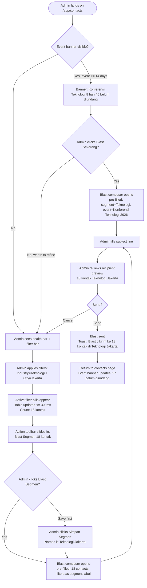
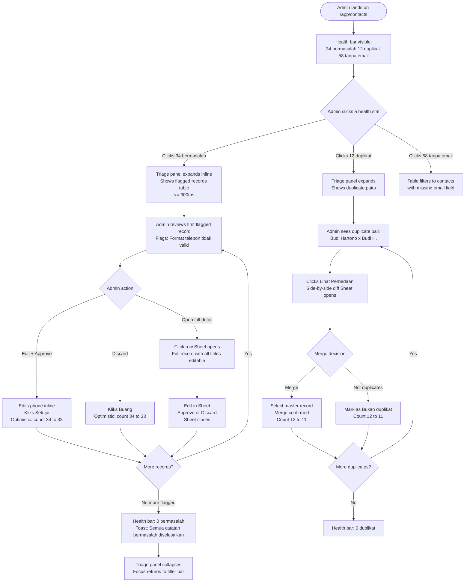
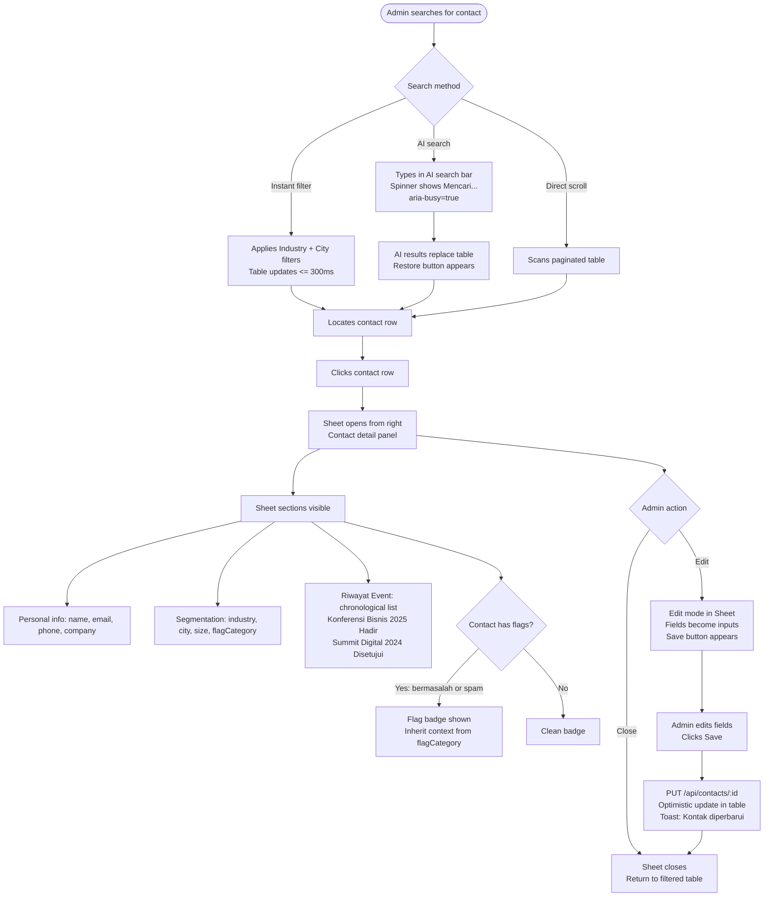

# UX Design Specification — Contacts Page Revamp

**Author:** Dian
**Date:** 2026-03-20

---

## Executive Summary

### Project Vision

Transform the Contacts page from a passive directory into a purposeful workspace — a **Contact Intelligence Hub** — where admins always know what to do next. The revamped page unifies contact discovery, data quality management, and pre-event audience readiness into a single cohesive experience that drives action.

### Target Users

**Primary:** Event admins at B2B event management companies using Yorindo to manage participant databases, approve registrations, and blast invitations before events.

**Secondary:** Staff members who triage flagged records and manage contact data quality.

### Design Problem

The current contacts page is a passive directory with filter + table + detail sheet. It answers "show me contacts" but never surfaces "what should I do now?" There is no sense of data health, no connection to upcoming events, and no pathway from contact discovery to action (invitation blast, triage, segmentation).

---

## Discovery: Design Understanding

### Jobs-to-Be-Done (Three Admin Jobs)

The contacts page must serve three distinct jobs:

1. **Find Contacts** — Quickly locate a specific person or set of people matching criteria (industry, company size, city, keyword). This is the current page's only job.

2. **Manage Database** — Monitor and improve data quality: resolve flagged records, merge duplicates, track completeness scores, ensure the database is trustworthy before using it for blasts.

3. **Pre-event Readiness Check** — Before an upcoming event, assess which contacts haven't been invited, which segments match the event's audience, and launch a blast from within the contacts workspace.

### Design Opportunities

| Opportunity | Signal | Value |
|---|---|---|
| **Audience Health Gauge** | % complete profiles, flagged count, duplicate count | Answers "is my database good enough?" at a glance |
| **Attention Panel** | Flagged + duplicate counts with direct links | Surfaces what needs action without hunting sub-pages |
| **Segment → Blast bridge** | Saved named segments linkable to blast action | Connects contact work to event operations |
| **Contact Timeline** | Last event attended, registration history | Turns a row into a participant story |

### Current Page Inventory

- Filter bar: industry / city / company size / AI smart search
- TanStack table: name, company, industry, city, phone, email
- Detail Sheet: contact fields + flag management + suggested events
- Sub-pages: `/contacts/flagged`, `/contacts/duplicates`, `/contacts/upload`

**Problem:** Sub-pages are orphaned. Users navigate away from contacts to triage flags and forget to come back. The main page has no awareness of data health.

### Design Direction: Mix (A + B + C)

The revamp combines three directions:

- **(A) CRM Action Hub** — Engagement history, surface uncontacted contacts, blast from segment
- **(B) Audience Health Dashboard** — Data quality KPIs, completeness scores, triage tools
- **(C) Smart Segmentation** — Saved named segments, segment-to-blast, AI search as segment builder

### Party Mode Additions

**1. Collapsible Triage Panel (inline, not sub-page)**
The flagged/duplicate sub-pages should be accessible as a collapsible inline panel within the main contacts view — or at minimum surfaced as a prominent action card — so triage work doesn't require context-switching away from the contacts workspace.

**2. Event-Contextual Banner**
When an upcoming event is within 14 days, show a contextual banner: *"[Event Name] is in N days — Y contacts in this segment haven't been invited. [Blast Now]"* This bridges contact management with active event operations and surfaces the most time-sensitive action.

**3. Sub-pages as Hub Model**
Reconceptualize: the main `/app/contacts` page becomes a hub with the flagged/duplicates/upload pages as panels or tabs within it, not separate routes. Navigation should feel like moving within a workspace, not leaving it.

**4. Async Search Constraint**
AI Smart Search must be visually differentiated from instant filters — it involves a server round-trip. Use a distinct "AI Search" button/badge that shows a loading state, so users understand why results aren't instant.

**5. Saved Segments as V2 Scope**
Full saved segment management (CRUD, segment library) is V2. V1 should support: (a) applying the current active filter as a "blast this segment" action, and (b) a simple "Save as segment" shortcut that stores the current filter set with a name. This prevents V1 scope creep while preserving the segment→blast bridge.

**6. Health Gauge as Entry Point**
The audience health gauge (completeness score, flagged count, duplicate count) should be the first thing visible on the page — above the filter bar — as a scannable 3-stat summary row. This anchors the "manage database" job at the top of the page before the admin dives into search.

**7. Contact Timeline in Detail Sheet**
The detail Sheet for a contact should include a "History" section showing: events they registered for, their registration status (approved/attended/cancelled), and last contacted date. This is derivable from existing MSW registration data (registrationsStore join).

---

## Core User Experience

### Defining Experience

The Contacts Intelligence Hub is built around **oriented action**: every visit ends with something done. The page surfaces the most time-sensitive action (event-contextual banner), provides an ambient health pulse, and makes audience discovery → blast a focused, low-friction flow.

The experience supports **two distinct loops**, not one:

- **Daily ops loop:** Health scan → Triage flagged/duplicates → Done
- **Pre-event loop:** Event countdown banner → Find/confirm segment → Blast

These loops have different mental modes and must feel distinct — different entry points, different UI affordances, different page states activated by context.

### Platform Strategy

**Platform:** Web-first, responsive. Tablet and desktop are primary (data-heavy tables, multi-step flows). Mobile is read-only: viewing and searching only — triage, blast, and upload are desktop-primary.

**Input model:** Mouse + keyboard primary. AI Smart Search is keyboard-driven with a clear async indicator (loading spinner, distinct "AI" badge). Table interactions use checkbox + sticky action toolbar pattern.

**Offline:** Not required.

**Data table strategy:** Server-side pagination is the primary scroll model. TanStack Table with `@tanstack/react-virtual` row virtualization for large result sets (>100 rows). AI search results are paginated server-side — AI search and instant filters can coexist as stacked query params; clearing AI search restores the previous filter state (filters are not reset on AI search clear).

### Effortless Interactions

| Interaction | How we make it effortless |
|---|---|
| **Health check** | 3-stat bar always visible: flagged count, duplicate count, actionable gaps (e.g. "34 records missing email") — no % completion metric |
| **Segment filter** | Pill-based active filters with instant visual feedback. Adding/removing filters snaps immediately. |
| **AI Smart Search** | Distinct "AI Search" bar with async badge + spinner. Results stack on top of active instant filters. Clearing AI search restores prior filter state. |
| **Blast from segment** | Sticky action toolbar appears when any filter is active: "Blast segment (N contacts)". One click to blast composer pre-filled with segment. |
| **Inline triage** | Flagged/duplicate counts in health bar are clickable — expand collapsible inline triage panel without page navigation. |
| **Duplicate merge** | In triage panel: "Mark as same person → Merge" one-click action. Merge confirmation shows diff of the two records. |
| **CSV upload feedback** | After upload completes, health bar updates immediately: "+N new contacts, X new flags detected, Y duplicates found." Closes the import loop with visible trust signal. |

### Critical Success Moments

1. **First load impression** — Admin lands and immediately sees "34 records missing email · 12 flagged · 5 duplicates." They know what needs doing before clicking anything.

2. **Event countdown click** — Admin sees "Konferensi Teknologi 2026 is in 8 days — 45 contacts in Teknologi segment haven't been invited." They click "Blast Now" → blast composer opens pre-filled with that segment.

3. **Search-to-blast in 60 seconds** — Admin filters by Industry=Teknologi + AI search "fintech decision makers" → reviews 18 contacts → clicks "Blast segment (18)" in the sticky action toolbar. Done. No sub-page navigation.

4. **Triage completion** — Admin opens inline triage panel, resolves 5 flagged records, watches health bar tick from 12 → 7. Tangible progress without leaving the page.

5. **Upload completion** — Admin uploads 80 CSV contacts. Health bar immediately shows: "+80 contacts added · 12 new flags · 0 duplicates detected." The loop closes with visible data-quality feedback.

6. **Zero state / first-time onboarding** — Admin arrives with 0 contacts. The health bar shows "No contacts yet." and a prominent CTA: "Import your first contacts (CSV)" or "Add contact manually." This state is in scope — the upload flow is already a sub-page.

### Experience Principles

1. **Always answer "what next?"** — Every page state (empty results, post-triage, post-blast) presents a clear next action. No dead ends.

2. **Surface counts, not percentages** — "34 records missing email" beats "68% complete." Actionable numbers tell the admin exactly what to fix.

3. **Segment is the unit of action** — You don't blast contacts; you blast a segment. Filters create segments. Segments connect to events. The sticky action toolbar makes this mental model unavoidable.

4. **Two tools, two speeds** — Instant filters (industry, city, company size) and AI search are visually distinct. Instant filters respond immediately. AI search shows a loading state. Users are never confused about why results aren't instant.

5. **Panels, not exits** — Triage, duplicates, and upload are operations within the contacts workspace. They open as inline panels or drawers. Navigation feels lateral, not vertical.

6. **Filters are sticky state** — Applying an AI search does not wipe instant filters. Clearing AI search restores the last filter state. The admin's filtering work is never lost.

---

## Desired Emotional Response

### Primary Emotional Goals

**Competent & In Control** — The admin should feel like the sharpest person in the room. The health bar, the event-contextual banner, the sticky action toolbar — all of these communicate: *you have full situational awareness, and the tools to act on it*. Never "how do I fix this?" Always "I know exactly what's happening and what to do next."

**Efficient without feeling rushed** — B2B event admins are busy. The page should feel fast and decisive, not cluttered. Every interaction should resolve in a single, satisfying step. The feeling after blasting a segment: *done and done*. No ceremony, no second-guessing.

### Emotional Journey Mapping

| Stage | Desired Feeling | How we create it |
|---|---|---|
| **First load** | Instant orientation — "I know where I am" | Health bar as the first visual anchor: counts, not numbers |
| **During daily triage** | Focused momentum — "I'm making progress" | Health counts tick down as records are resolved; inline panel keeps context |
| **Pre-event prep** | Urgency + confidence — "I'm on top of this" | Event countdown banner with clear "Blast Now" CTA |
| **After blast is sent** | Accomplishment — "That's done, what's next?" | Post-blast toast: "Blast sent to 45 contacts in Teknologi segment" |
| **When something goes wrong** | Informed, not blindsided — "I see the problem" | Actionable error states: "12 records flagged — [Review now]" not generic alerts |
| **Returning to the page** | Comfortable familiarity — "I know this workspace" | Consistent layout, remembered filter state, persistent health bar |

### Micro-Emotions

| Emotion we want | Where it shows up |
|---|---|
| **Confidence** | Every filter pill snapping instantly. The admin's intent is never questioned. |
| **Trust** | Health counts backed by real data. "34 missing email" is provable. |
| **Momentum** | Inline triage panel with visible count change. Progress is felt, not just assumed. |
| **Delight (small)** | AI search finds exactly the right segment on first try. "It understood what I meant." |
| **Relief** | Uploading CSV and seeing "0 duplicates detected." The database didn't break. |

Emotions to avoid:
- **Confusion** — ambiguous filter interactions, unclear AI search state
- **Anxiety** — data loss fear (cleared filters), blast going to wrong segment
- **Overwhelm** — too many actions visible at once; action toolbar should be contextual, not always-on

### Design Implications

| Emotional goal | UX design approach |
|---|---|
| Competent & in control | Health bar always visible above the fold. Nothing about database state is hidden. |
| Efficient without rushed | Single-click path for the most frequent actions. No confirmation dialogs for reversible ops. |
| Momentum during triage | Optimistic UI: count drops immediately on resolve, rolls back on error. |
| Trust in data | Counts are always specific and attributable ("34 missing email", not "incomplete"). |
| No anxiety around blast | Segment preview (N contacts) shown before blast composer opens. Admin knows what they're sending. |
| No confusion around AI | Visual separation: instant filters = pills in filter bar. AI search = separate input with "AI" badge. |

### Emotional Design Principles

1. **Reward action, not exploration** — Animations and feedback confirm what was done, not what could be done. Post-action toasts are specific: "5 records resolved · 7 remaining" not "Changes saved."

2. **Make the database feel trustworthy** — Every data quality signal (flagged count, missing fields, duplicates) uses specific, attributable language. Vague health scores erode trust; concrete counts build it.

3. **Pre-empt anxiety at decision points** — Before any high-stakes action (blast, merge, delete), surface exactly what will happen. Segment blast shows a count preview. Merge shows a side-by-side diff. No surprises.

4. **Invisible competence** — The most satisfying interactions are the ones where the admin didn't have to think. Filter snapping, AI search finding the right cohort, the event banner appearing right when it's needed. Design should feel like it read their mind.

---

## UX Pattern Analysis & Inspiration

### Inspiring Products Analysis

**1. Linear (linear.app) — Issue tracking workspace**
- Solves: "What needs my attention now?" for engineering teams — exactly our admin's problem
- Health signal: Project status sidebar with count badges (open issues, blocked) always visible
- Navigation: Keyboard-first, instant filter application, no page reloads
- Standout pattern: **Triage mode** — swimlane view that collapses resolved items and surfaces urgent ones at top. Our inline triage panel should borrow this progressive-disclosure approach
- Error/edge case: Graceful empty states with specific next actions ("No blocked issues — you're clear")

**2. Airtable (airtable.com) — Database + view builder**
- Solves: The "filter → view → act" loop for non-technical users managing structured data
- Standout pattern: **Saved views** — named filter sets that persist and are shareable. This is exactly the V1 "Save as segment" shortcut we scoped. Airtable's implementation: filter bar has a "Save view" button that names + stores the current state
- Standout pattern: **Toolbar appears on row selection** — contextual bulk-action bar slides in from bottom when rows are checked. Our sticky action toolbar should follow this pattern
- Anti-pattern they avoided: No pagination UI complexity — they use infinite scroll with virtualization

**3. HubSpot Contacts (CRM) — Contact list + engagement**
- Solves: Sales team's "who do I contact next?" — closest analogue to our use case
- Standout pattern: **Activity timeline in contact drawer** — last contacted, email sent, deals associated. This validates our Contact Timeline in detail Sheet decision
- Standout pattern: **Filter sidebar with live count** — filter options show "(47)" next to each value, updating in real time. Our industry/city filter pills should show contact counts
- Anti-pattern to note: HubSpot's health/completeness features are buried 3+ levels deep. We deliberately surface ours at the top of the page

**4. Notion (databases view) — Structured content workspace**
- Standout pattern: **View toggle** — same data, multiple perspectives (table / gallery / kanban). Inspires our future "contact card view" vs table view toggle
- Standout pattern: **Inline property editing** — click a cell, edit in place, no modal. Our triage panel supports inline field editing for flagged records (already implemented in `/contacts/flagged`)

### Transferable UX Patterns

**Navigation Patterns:**
- **Linear's triage mode** → Our inline triage panel: collapsed by default, expands with count badge, resolved items visually muted
- **Airtable's saved views** → Our "Save as segment" shortcut in the filter bar

**Interaction Patterns:**
- **Airtable's contextual bulk toolbar** → Our sticky action toolbar: hidden until filter active or rows selected, slides in from bottom on mobile / appears inline on desktop
- **HubSpot's live filter counts** → Filter pills show "(N)" next to each option — "Teknologi (47)" — so admins know segment size before applying
- **Notion's inline editing** → Triage panel field edits happen in-place, no separate modal

**Visual Patterns:**
- **Linear's count badges** → Health bar stats use badge styling (pill with number) for scannability
- **HubSpot's activity timeline** → Contact detail Sheet history section: chronological list of events, each with status dot (approved/attended/cancelled)
- **Linear's empty states** → Context-specific CTAs: zero flagged records shows "Your database is clean" not a generic empty state

### Anti-Patterns to Avoid

1. **Salesforce-style pagination controls** — Page 1 of 47, next/prev buttons, page size selector in a footer. Use server-side cursor pagination with "Load more" or virtualized scroll.

2. **HubSpot's buried health data** — Data quality stats hidden in Settings > Data Management > Properties. We put ours in the header on every visit.

3. **Modal-heavy triage** — Opening a full modal for every flagged record review. Use inline panels (Sheet/drawer) or in-place expansion instead.

4. **Filter state loss on search** — Many tools reset all filters when you use the search bar. We explicitly keep filter state when AI search is applied or cleared.

5. **Generic toast messages** — "Saved successfully." Instead: "5 records resolved · 7 remaining flagged."

6. **Always-visible bulk action bars** — Showing "Delete selected / Export selected" toolbars even when nothing is selected creates visual noise. Contextual appearance only.

### Design Inspiration Strategy

**Adopt directly:**
- Linear's count-badge health indicators in page header
- Airtable's contextual bulk-action toolbar (appears on row select or active filter)
- HubSpot's activity timeline structure for the contact detail Sheet

**Adapt for our context:**
- Airtable's "Save view" → our "Save as segment" (simpler: just name + save current filter, no view columns customization)
- HubSpot's live filter counts → show only on the filter dropdown options, not on every pill (avoids re-query on every filter change)
- Linear's triage mode → our inline triage panel is simpler: one panel, one type of record at a time (flagged OR duplicates, not mixed)

**Avoid entirely:**
- Salesforce-style dense table with 20+ visible columns
- Modal-first triage flows
- Filter resets on search
- Vague completion percentages (HubSpot's "Profile completeness: 60%")

---

## Design System Foundation

### Design System Choice

**shadcn/ui + Tailwind CSS** — the existing design system already in use throughout the Yorindo app. All components (Card, Table, Sheet, Badge, Button, Input, Select, Tabs) are already installed and in active use.

This is not a new selection — it's a constraint from the existing codebase. The contacts revamp must extend this system, not replace it.

### Rationale for Selection

- **Already in production** — Every existing page uses shadcn/ui components. Diverging would create visual inconsistency and double the component surface area.
- **Perfectly suited to the design direction** — shadcn/ui's composable, unstyled-first approach means we can achieve Linear-style density (tight spacing, muted backgrounds, clear hierarchy) without fighting the library.
- **Tailwind's utility classes handle our animation needs** — optimistic UI updates (count transitions, toolbar slide-in) are achievable with `transition-all`, `animate-pulse`, and custom keyframes if needed.
- **shadcn/ui Sheet is already our detail drawer pattern** — the contact detail Sheet, the flagged record Sheet, the registration Sheet all use the same component. Consistency is already established.

### Implementation Approach

| Component need | shadcn/ui solution |
|---|---|
| Health bar stats | Custom stat cards using `Card` + `Badge` components |
| Event-contextual banner | `Alert` or custom `div` with `bg-muted` + icon |
| Filter pills | `Badge` with `variant="secondary"` + close button |
| Sticky action toolbar | Custom positioned `div` with `Card` shadow, appears via conditional render |
| Inline triage panel | Collapsible `div` with `transition-all max-h` animation |
| Contact detail Sheet | Existing `Sheet` component — extend with History section |
| AI search input | `Input` with trailing `Badge` ("AI") + `Loader2` icon from lucide-react |
| Duplicate merge diff | Two-column grid inside `Sheet`, fields with `text-muted-foreground` for original vs. edited |

### Customization Strategy

**Design tokens to establish for this feature:**
- Health stat colors: `text-destructive` for flagged/duplicates when count > 0, `text-muted-foreground` when clean
- Event banner: amber/warning tone — use `bg-amber-50 border-amber-200 text-amber-900` (Tailwind utilities, not new tokens)
- AI badge: `bg-violet-100 text-violet-700` to visually distinguish from instant filter pills

**New patterns (not in existing codebase):**
- Sticky contextual action toolbar — needs a `z-10 sticky bottom-4` positioned element that conditionally renders
- Collapsible inline panel — `overflow-hidden transition-all` with `max-h-0` / `max-h-screen` toggle
- Filter count annotations in dropdown — "(N)" suffix in `SelectItem` text

**No new dependencies needed.** All implementation targets components already installed.

---

## Defining Core Experience

### Defining Experience

**"Filter contacts into a segment, then act on it in one click."**

The Contacts Intelligence Hub's core loop: an admin builds a mental picture of their audience (Teknologi companies, mid-size, Jakarta, haven't attended in 12 months), the page translates that picture into a live segment count, and a single action sends an invitation to all of them. No exports, no copy-paste, no tab-switching.

Everything else — health bar, triage panel, event banner — exists to either set up this moment (clean data → reliable segments) or arrive at it faster (event banner shortcuts the filter step).

### User Mental Model

Admins currently think in **lists and blasts**: export filtered Excel → import to blast tool → send. Mental model: "I have a pile of contacts → I pick some → I send to them."

Our shift: **the filter IS the segment, and the segment IS the blast target.** No intermediate list. The admin describes an audience; the page finds and counts them in real time.

Confusion points to address:
- **"Is this filter permanent?"** — No. Filters are session state. The "Save as segment" button makes the distinction explicit.
- **"What exactly will the blast go to?"** — Segment count in the action toolbar ("Blast segment · 47 contacts") must be visually prominent and always accurate.
- **"Did I just blast everyone?"** — The blast composer is the safety net. One click from contacts opens the composer pre-filled — it does not send immediately.

### Success Criteria

1. **Filter → count appears in ≤300ms** — Instant filters must feel instant.
2. **Segment count matches admin's expectation** — If they filtered "Teknologi + Jakarta", the number shown matches their mental model of that audience.
3. **Path to blast composer is one click** — No intermediate steps, no confirmation modal before reaching the composer.
4. **Composer arrives pre-filled** — Event selection, recipient list, and subject line pre-populated from segment context.
5. **Post-blast feedback is specific** — "Blast sent to 47 contacts in Teknologi · Jakarta segment" — not "Success."

### Novel vs. Established Patterns

**Mostly established, one innovative combination:**

Individual patterns (filter pills, action toolbar, drawer/sheet) are well-established — no user education needed. The innovative combination: **filter bar doubles as segment builder, and segment is a live blast target.** Most CRMs separate segment management / contact list / blast into three separate sections. We collapse all three into one flow.

The "Save as segment" button in the filter bar is the education moment — it teaches the mental model through the affordance itself.

### Experience Mechanics

**The Segment → Blast flow:**

**1. Initiation**
- Admin lands on contacts page
- Instant filters visible in toolbar (Industry, City, Company Size dropdowns)
- AI Search input to the right with violet "AI" badge
- Default state: no filters active, action toolbar hidden

**2. Interaction**
- Admin selects Industry = "Teknologi" → pill appears, table updates, count updates
- Optionally adds City = "Jakarta" → second pill, count refines
- Action toolbar slides in at bottom of table: `[☐ Select all] [Blast segment · 47 contacts →]`
- Admin clicks "Blast segment · 47 contacts →"

**3. Feedback**
- Toolbar button shows loading spinner for ~200ms
- Blast composer opens pre-filled:
  - Recipients: "47 contacts · Teknologi · Jakarta"
  - Event: pre-selected if event-contextual banner was active
  - Subject: blank (admin fills)
- Admin sees exactly who they're about to reach before sending anything

**4. Completion**
- Blast is sent from composer (separate action)
- User returns to contacts page
- Toast: "Blast sent to 47 contacts in Teknologi · Jakarta segment"
- Event-contextual banner updates: "45 contacts invited → 2 remaining"

---

## Visual Design Foundation

### Color System

The app uses shadcn/ui's CSS variable color system (HSL-based). Existing semantic tokens in use:

| Token | Usage |
|---|---|
| `background` / `foreground` | Page background, primary text |
| `card` / `card-foreground` | Card surfaces |
| `muted` / `muted-foreground` | Subtle backgrounds, secondary text |
| `primary` / `primary-foreground` | Primary buttons, active states |
| `destructive` / `destructive-foreground` | Error states, delete actions |
| `border` | Dividers, input borders |
| `ring` | Focus rings |

**New semantic mappings for contacts revamp:**

| Purpose | Tailwind class | Rationale |
|---|---|---|
| **Health stat — alert** | `text-destructive` | Flagged/duplicate counts when > 0 |
| **Health stat — clean** | `text-muted-foreground` | Zero count state |
| **Event countdown banner** | `bg-amber-50 border-amber-200 text-amber-900` | Urgency without alarm — amber conveys "time-sensitive" |
| **AI search badge** | `bg-violet-100 text-violet-700` | Visually distinct from instant filter pills |
| **Triage panel background** | `bg-muted/50` | Slightly inset from main content, same surface family |
| **Segment action toolbar** | `bg-background border shadow-md` | Elevated above table, clearly a separate action layer |

**Accessibility:** All color combinations maintain ≥4.5:1 contrast ratio. No color is used as the sole indicator of state — badges always include text labels.

### Typography System

Inherits the app's existing typography stack (system font via Tailwind's `font-sans`). No changes to the base type system:

| Level | Class | Usage |
|---|---|---|
| Page title | `text-2xl font-bold` | "Kontak" heading |
| Section label | `text-sm font-medium text-muted-foreground uppercase tracking-wide` | Health bar stat labels |
| Stat number | `text-2xl font-bold` | Health bar counts (34, 12, 5) |
| Table header | `text-xs font-medium` (TableHead) | Column names |
| Body | `text-sm` | Table cells, form fields |
| Caption | `text-xs text-muted-foreground` | Secondary info, timestamps |

**Hierarchy principle:** Numbers are large and bold (health stats, segment count in toolbar). Labels are small and muted. The visual weight of numbers communicates importance.

### Spacing & Layout Foundation

**Base unit:** 4px (Tailwind default). All spacing uses multiples: 4, 8, 12, 16, 24, 32px.

**Page layout (top to bottom):**
```
[Health Bar — full width, 3 stats]        ← always visible
[Event Banner — conditional, full width]  ← when event within 14 days
[Filter Bar — full width]                 ← industry | city | size | AI search | Save segment
[Triage Panel — collapsible, full width]  ← expanded on click from health bar
[Contact Table — full width]              ← paginated, virtualized
[Action Toolbar — sticky bottom]          ← conditional, when filter active
```

**Density target:** Linear-inspired compact. Table rows at `h-12` (48px). Health bar stats use `py-4 px-6`. Filter bar is `py-3`.

**Mobile layout:** Health bar stats wrap to 2+1. Filter bar: single scrollable chip strip. Action toolbar: full-width bottom button. Table: Name + Industry visible, others `hidden md:table-cell`.

### Accessibility Considerations

1. **Color + text always paired** — Health stats use both color and text label. Never color alone.
2. **Focus management for inline panels** — Triage panel expand moves focus to first interactive element; collapse returns focus to trigger.
3. **Action toolbar keyboard access** — Tab order: filter pills → AI search → action toolbar → table rows.
4. **AI search loading state** — `aria-busy="true"` on results container during search.
5. **Sheet/drawer focus trap** — Contact detail Sheet uses shadcn/ui's built-in focus trap. Triage panel follows same pattern.

---

## Design Direction Decision

### Design Directions Explored

Five directions were explored via an interactive HTML showcase (`ux-design-directions.html`):

1. **Command Center** — Full-width health bar + event banner at top, filter bar, table, sticky contextual action toolbar
2. **Clean Hub** — Health stats inline in page header, more compact, less visual hierarchy
3. **Sidebar Nav** — Left sidebar for filters + health stats, main area is purely the table
4. **Card Grid** — Contacts as visual cards instead of table rows, with view toggle
5. **Split Panel** — Master-detail layout: list on left, contact detail always visible on right

### Chosen Direction

**Direction 1 — Command Center**

The health bar occupies a dedicated full-width row at the top of the page. The event-contextual banner sits directly below it when active. The filter bar follows. The contact table fills the main area. A sticky action toolbar appears at the bottom of the table when any filter is active or rows are selected.

### Design Rationale

- **All three jobs are visible without scrolling** — Health bar anchors "Manage Database". Event banner anchors "Pre-event Readiness". Filter bar + action toolbar anchors "Find + Blast". An admin arriving on the page immediately has situational awareness across all three jobs.
- **Health stats need dedicated visual weight** — The inline-header approach (Direction 2) reduces the health bar to a secondary concern. For the "Manage Database" job to feel like a first-class priority, the stats need to be large, bold, and above the fold.
- **Sidebar (Direction 3) requires too wide a viewport** — The target is tablet + desktop, not just wide desktop. Command Center works from 768px up.
- **Card grid (Direction 4) doesn't scale to 200+ contacts** — Table remains the primary view; card grid is a future enhancement.
- **Split panel (Direction 5) is correct for CRM power users** — Out of scope for V1. Could be a future "CRM mode" toggle.

### Implementation Approach

The Command Center layout maps directly to a vertical stack of React components:

```
<ContactsPage>
  <HealthBar />                     {/* always rendered */}
  <EventBanner />                   {/* conditional: upcoming event within 14 days */}
  <PageHeader />                    {/* title + Import/Add buttons */}
  <FilterBar />                     {/* instant filters + AI search + Save segment */}
  <ActiveFilterPills />             {/* conditional: when filters active */}
  <TriagePanel />                   {/* collapsible: triggered from HealthBar */}
  <ContactTable />                  {/* paginated, virtualized */}
  <ActionToolbar />                 {/* sticky bottom: conditional when filter active */}
</ContactsPage>
```

Reference mockup: `_bmad-output/planning-artifacts/ux-design-directions.html` → Direction 1

---

## User Journey Flows

### Journey 1: Pre-event Blast (Primary Loop)

The highest-value, most time-pressured flow. Triggered by the event-contextual banner.



**Optimizations:**
- Event banner bypasses filter step — zero clicks to blast composer when segment is obvious
- Segment count in toolbar is always live — admin never wonders "how many will this go to?"
- Composer pre-fills everything except subject line — minimum admin input required

---

### Journey 2: Daily Triage (Manage Database Loop)

The routine data quality maintenance flow. Entry from health bar stats.



**Optimizations:**
- Triage panel expands inline — no navigation away from contacts page
- Optimistic UI: count decrements immediately on approve/discard, rolls back on error
- Panel collapses and returns focus after last record resolved — natural completion signal

---

### Journey 3: Contact Detail Review (Find Contacts Loop)

Finding a specific contact and reviewing their full profile + history.



**Optimizations:**
- AI search shows restore button — no filter loss anxiety
- Event history in Sheet surfaces engagement context before blasting
- Sheet edit mode inline — no navigation to a separate edit page

---

### Journey Patterns

**Navigation patterns:**
- **Expand-in-place** — Triage panel, active filter pills, AI search results appear within the current page. Used for medium-depth operations.
- **Sheet/drawer for deep detail** — Contact detail, flagged record editing, duplicate merge diff all use a Sheet. Used for single-record focus operations.
- **Page-level navigation only for composition** — Blast composer is the only action that fully navigates away.

**Decision patterns:**
- **Optimistic UI for reversible ops** — Approve/discard flagged records, clear flags. Count updates immediately; error rolls back with toast.
- **Preview before high-stakes action** — Blast shows recipient count before opening composer. Merge shows side-by-side diff before confirming.
- **Escape hatches always present** — AI search has "restore" button. Sheet has close. Filter pills have "×".

**Feedback patterns:**
- **Specific toasts** — "Blast dikirim ke 18 kontak di Teknologi · Jakarta" not "Berhasil"
- **Ambient count updates** — Health bar counts decrement in real time during triage
- **Loading states distinguished** — Instant filters: no spinner. AI search: spinner + aria label. Mutations: button disabled + spinner.

### Flow Optimization Principles

1. **Measure steps to blast** — Pre-event blast journey reaches composer in ≤2 clicks from event banner.
2. **Triage completion is tangible** — Health bar is the progress indicator. Watching 34→0 is the reward.
3. **AI search never loses context** — Restore button present while AI results shown. Filter state preserved in memory.
4. **Sheet is the detail surface** — All single-record operations happen in the Sheet. No modals, no new routes.

---

## Component Strategy

### Design System Components (Already Available)

All from shadcn/ui — no new installs needed:

| Component | Usage in contacts revamp |
|---|---|
| `Card` | Health stat wrappers, triage panel container |
| `Badge` | Filter pills, flag labels, AI search badge, industry tags |
| `Button` | Primary (blast, approve), outline (save segment, discard) |
| `Input` | AI search input, inline field editing in triage |
| `Select` / `SelectItem` | Industry, city, company size filter dropdowns |
| `Sheet` / `SheetContent` | Contact detail drawer, duplicate merge diff drawer |
| `Table` / `TableRow` / `TableCell` | Contact list, triage panel flagged records |
| `Separator` | Section dividers inside Sheet |
| `Skeleton` | Loading states for health bar, table rows |
| `Sonner` (toast) | All post-action feedback toasts |
| `Alert` | Event-contextual banner (amber variant) |
| `Tabs` | Sheet sections (Info / Riwayat / Segmen) |

### Custom Components

Six new components required — none exist in the current codebase.

#### `HealthBar`
**Purpose:** Persistent database quality pulse — primary page orientation anchor.
**Anatomy:** 3-column grid. Each stat: label (uppercase, muted) → count (2xl bold, colored) → action hint (caption, clickable).
**States:** `alert` (count > 0, text-destructive, cursor-pointer) · `clean` (count = 0, muted, "Semua bersih ✓") · `loading` (Skeleton)
**Interaction:** Click stat → `onStatClick(type: 'flagged' | 'duplicates' | 'missingEmail')` → parent expands TriagePanel or applies table filter.
**Accessibility:** Each stat column is a `button` with descriptive `aria-label`. `role="status"` on container for live count updates.

#### `EventBanner`
**Purpose:** Surfaces the most time-sensitive action — pre-event blast shortcut.
**Anatomy:** Full-width amber strip. Left: calendar icon + event name + days remaining + uncontacted count. Right: "Blast Sekarang →" button.
**States:** `visible` (event ≤14 days, uncontacted > 0) · `hidden` (renders null) · `loading` (Skeleton strip)
**Props:** `eventName`, `daysUntil`, `uncontactedCount`, `onBlast: () => void`
**Accessibility:** `role="alert"` with `aria-live="polite"`.

#### `FilterBar`
**Purpose:** Instant filter controls + AI search + Save segment shortcut.
**Anatomy:** Horizontal flex. Left: 3 Select dropdowns with count suffix ("Teknologi (47)"). Right: AI search Input with violet "AI ✦" badge + Loader2 spinner. Far right: "Simpan Segmen" button (conditional on active filters).
**States:** `idle` · `filtering` (save button appears) · `ai-searching` (spinner, input disabled) · `ai-results` ("Restore" chip appears)
**Accessibility:** Each Select has `aria-label`. AI input has `aria-busy={isSearching}`.

#### `ActiveFilterPills`
**Purpose:** Visual confirmation of active filters + dismissal affordance.
**Anatomy:** Horizontal scrollable flex. Each filter: Badge (gray=instant, violet=AI) + "×" close button. "Hapus semua" link when ≥2 active. Contact count: "18 kontak ditemukan".
**States:** `empty` (renders null) · `populated` (pills + count visible)

#### `TriagePanel`
**Purpose:** Inline triage workspace — avoids navigation to `/contacts/flagged` for routine work.
**Anatomy:** Collapsible div (`overflow-hidden transition-all duration-200`). Header: title + collapse button. Body: reuses existing FlaggedRecordsTable or DuplicatePairsTable internals.
**States:** `collapsed` (max-h-0) · `expanded-flagged` · `expanded-duplicates` · `expanded-missing` (applies table filter, no panel)
**Focus management:** Expand → focus first interactive element. Collapse → focus returns to triggering HealthBar stat.

#### `ActionToolbar`
**Purpose:** Contextual blast/export actions — visible only when meaningful.
**Anatomy:** Sticky bottom bar (`sticky bottom-0 z-10`). Left: select-all checkbox + count. Right: "Export CSV" + "Blast Segmen · N kontak →".
**States:** `hidden` (no filters, no selection) · `filter-active` (segment blast with live count) · `rows-selected` (row-specific actions) · `blasting` (spinner, disabled)
**Interaction:** "Blast Segmen" → navigate to `/app/blasts/new?segment=teknologi,jakarta&count=18`
**Accessibility:** `role="toolbar"` with `aria-label="Aksi segmen"`. `aria-hidden` when not visible.

### Component Implementation Roadmap

**Phase 1 — Core (page renders and core loop works):**
1. `HealthBar`
2. `FilterBar`
3. `ActiveFilterPills`
4. `ActionToolbar`

**Phase 2 — Complete all three journeys:**
5. `EventBanner`
6. `TriagePanel` (wraps existing flagged/duplicates page internals)

**Existing to extend:**
- `ContactsTable` — add row selection, flag badges, history tab in Sheet
- `/contacts/flagged` page internals — extract for reuse inside `TriagePanel`

---

## UX Consistency Patterns

### Button Hierarchy

| Level | Component | Usage | Example |
|---|---|---|---|
| **Primary** | `Button` (default) | One per toolbar section. The main forward action. | "Blast Segmen · 18 kontak →" |
| **Secondary** | `Button variant="outline"` | Supporting actions alongside primary. | "Export CSV", "Simpan Segmen" |
| **Destructive** | `Button variant="outline" className="text-destructive"` | Irreversible actions — never primary weight. | "Buang" in triage |
| **Ghost** | `Button variant="ghost"` | Navigation links, collapse toggles. | "← Kembali ke Kontak" |
| **Icon-only** | `Button variant="ghost" size="icon"` | Close buttons, collapse toggles in compact spaces. | "×" on filter pills |

**Rules:** Never more than one primary button per toolbar section. Blast button always shows live count. Destructive actions never use primary styling.

### Feedback Patterns

**Toast messages (Sonner) — always specific:**

| Situation | Pattern | Example |
|---|---|---|
| Mutation success | Specific result | "5 catatan diselesaikan · 29 tersisa" |
| Blast sent | Segment context included | "Blast dikirim ke 18 kontak di Teknologi · Jakarta" |
| Upload complete | Full summary | "+80 kontak ditambahkan · 12 flag baru · 0 duplikat" |
| Mutation error | Actionable | "Gagal menyimpan — coba lagi" |
| Optimistic rollback | Explains what happened | "Perubahan dibatalkan — terjadi kesalahan" |

**Loading states:**
- Instant filters (≤300ms): no spinner — updates feel instant
- AI search: `Loader2` in input + `aria-busy="true"` on results container
- Mutations: button `disabled` + spinner replaces leading icon
- Initial load: `Skeleton` for health bar stats + first 5 table rows

**Empty states:**

| Context | Message | CTA |
|---|---|---|
| No contacts yet | "Belum ada kontak" | "Import CSV" or "Tambah kontak" |
| Filter no results | "Tidak ada kontak untuk filter ini" | "Hapus filter" |
| AI no results | "Tidak ada hasil untuk pencarian ini" | "Restore filter" |
| Triage all clean | "Tidak ada catatan bermasalah ✓" | — (close panel) |

### Form Patterns

- **Inline editing:** Fields display as `<p>`; "Edit" switches to `<Input>` in-place. Save/Cancel appear contextually. Validation errors: `text-destructive text-xs` below field.
- **Filter dropdowns:** Options include live counts "Teknologi (47)". Trigger shows clean label without count. "Semua [dimension]" always first option.
- **Sheet forms:** Save/Cancel sticky at bottom. Unsaved changes guard on close: "Perubahan belum disimpan. Tutup?"

### Navigation Patterns

**Lateral (no page transition):** Health stat click → TriagePanel expand · Filter pill × → remove filter · Contact row click → Sheet · "Simpan Segmen" → inline name input

**Page transition (intentional exit):** "Blast Segmen →" → `/app/blasts/new?...` · "Import CSV" → `/app/contacts/upload` · Sub-pages show "← Kembali ke Kontak" ghost button

**URL state:** All filter state persists in query params: `?industry=teknologi&city=jakarta&q=fintech+decision+makers`

### Search and Filter Patterns

- Instant filters AND AI search are stacked (AND relationship) — both remain active simultaneously
- AI search has Restore chip to clear only AI search, preserving instant filters
- Filter state is never lost when AI search is applied or cleared
- Filter counts in SelectItem: "Teknologi (47)" — from `/api/contacts/facets`

### Overlay and Panel Patterns

- **Sheet:** `sm:max-w-lg` (512px), consistent across all usages. Focus trap. Closeable via ×, Escape, backdrop.
- **TriagePanel:** Inline collapsible, `transition-all duration-200`. One open at a time. Not a modal — page remains scrollable.
- **Dialog:** Reserved only for destructive confirmations (merge, bulk delete). Never used for viewing or editing.

---

## Responsive Design & Accessibility

### Responsive Strategy

**Desktop (≥1024px) — Primary target:**
Full Command Center layout. All 6 layers visible: HealthBar, EventBanner, PageHeader, FilterBar, ContactTable, ActionToolbar. Three columns in HealthBar. Filter bar inline with dropdowns + AI search. ActionToolbar sticky bottom with full button labels.

**Tablet (768px–1023px) — Secondary target:**
Same page layout, reduced density. HealthBar 3-column grid. Table: Name + Company + Industry visible, City hidden (`hidden lg:table-cell`). ActionToolbar full-width sticky bottom.

**Mobile (<768px) — Read-only browsing:**
Table: Name + Industry only. HealthBar: 2-column grid wrap. FilterBar: stacked vertically. ActionToolbar: single full-width button. TriagePanel: `CollapsibleContent` renders inline full-width.

**Sheet responsive:** Use `side="right"` at all breakpoints with `className="sm:max-w-lg w-full"`. Avoids SSR-unsafe `isMobile` / `window.innerWidth` checks in Next.js.

### Breakpoint Strategy

Tailwind default breakpoints (mobile-first):

| Breakpoint | Width | Changes |
|---|---|---|
| `(default)` | 0px | Mobile — 2-col HealthBar, stacked FilterBar, Name+Industry table only |
| `md` | 768px | Tablet — City/Company columns appear, FilterBar inline |
| `lg` | 1024px | Desktop — full layout, all columns, HealthBar 3-col |
| `xl` | 1280px | Wide desktop — increased padding only |

### Accessibility Strategy

**Target:** WCAG 2.1 Level AA.

| Requirement | Implementation |
|---|---|
| Color contrast ≥4.5:1 | All color pairings validated (see Visual Foundation) |
| Keyboard navigation | Tab order: HealthBar stats → EventBanner → FilterBar → FilterPills → Table → ActionToolbar |
| Focus indicators | Tailwind `ring` style — never removed without replacement |
| ARIA labels | `aria-label` on icon-only buttons; `aria-live="polite"` on HealthBar container; `aria-busy` on AI search; `role="toolbar"` on ActionToolbar |
| Touch targets | Minimum 44×44px — filter pills `h-8 min-w-[44px]`, table rows `h-12` |
| Focus management | `CollapsibleTrigger` handles `aria-expanded` automatically; Sheet uses shadcn built-in focus trap |
| Skip link | `<a href="#contact-table" className="sr-only focus:not-sr-only ...">Langsung ke tabel kontak</a>` |
| Reduced motion | `CollapsibleContent` animation classes prefixed with `motion-safe:` |

### shadcn/ui Component Mapping (Complete Audit)

Every component in the revamp mapped to its shadcn/ui primitive — no raw divs where a shadcn component exists:

| Feature | shadcn/ui component(s) |
|---|---|
| **HealthBar** | `Card` (wrapper) + Tailwind grid + `Button` (each stat) |
| **EventBanner** | `Alert` with `bg-amber-50 border-amber-200` className override |
| **FilterBar dropdowns** | `Select` + `SelectTrigger` + `SelectContent` + `SelectItem` |
| **AI search input** | `Input` + `Badge` (violet "AI ✦") + Lucide `Loader2` in relative wrapper |
| **Save as segment** | `Popover` + `PopoverTrigger asChild` + `PopoverContent` + `Input` + `Button` |
| **ActiveFilterPills** | `ScrollArea orientation="horizontal"` + `Badge` + `Button variant="ghost" size="icon"` |
| **TriagePanel** | `Collapsible` + `CollapsibleTrigger asChild` + `CollapsibleContent` |
| **Contact table** | `Table` + `TableHeader` + `TableBody` + `TableRow` + `TableCell` + `TableHead` |
| **ActionToolbar** | `Card className="sticky bottom-0 z-10 rounded-none border-t border-x-0 border-b-0"` |
| **Contact detail Sheet** | `Sheet` + `SheetContent` + `SheetHeader` + `SheetTitle` + `Tabs` + `Separator` |
| **Duplicate merge diff** | `Sheet` + two-column grid + `Separator` |
| **Destructive confirm** | `AlertDialog` + `AlertDialogTrigger` + `AlertDialogContent` + `AlertDialogAction` |
| **Layer dividers** | `Separator` between HealthBar / EventBanner / FilterBar |
| **Loading skeleton** | `Skeleton` for health stats + first 5 table rows |

### Implementation Patterns

```tsx
// TriagePanel — shadcn Collapsible
<Collapsible open={triageOpen} onOpenChange={setTriageOpen}>
  <CollapsibleTrigger asChild>
    <button aria-label="34 catatan bermasalah, klik untuk tinjau">...</button>
  </CollapsibleTrigger>
  <CollapsibleContent className="overflow-hidden motion-safe:data-[state=open]:animate-collapsible-down motion-safe:data-[state=closed]:animate-collapsible-up">
    {/* FlaggedRecordsTable or DuplicatePairsTable */}
  </CollapsibleContent>
</Collapsible>

// ActionToolbar — sticky Card
<Card className="sticky bottom-0 z-10 rounded-none border-t border-x-0 border-b-0 flex items-center justify-between px-4 py-3">
  <span className="text-sm text-muted-foreground">18 kontak di segmen ini</span>
  <Button>Blast Segmen · 18 kontak →</Button>
</Card>

// Save as Segment — Popover
<Popover>
  <PopoverTrigger asChild>
    <Button variant="outline" size="sm">Simpan Segmen</Button>
  </PopoverTrigger>
  <PopoverContent className="w-64 space-y-2">
    <Input placeholder="Nama segmen..." autoFocus />
    <Button size="sm" className="w-full">Simpan</Button>
  </PopoverContent>
</Popover>

// ActiveFilterPills — ScrollArea
<ScrollArea orientation="horizontal" className="w-full whitespace-nowrap">
  <div className="flex items-center gap-2 px-6 py-2">
    {activeFilters.map(f => (
      <Badge key={f.key} variant="secondary" className="flex items-center gap-1">
        {f.label}
        <Button variant="ghost" size="icon" className="h-4 w-4 p-0" onClick={() => removeFilter(f.key)}>
          <X className="h-3 w-3" />
        </Button>
      </Badge>
    ))}
  </div>
</ScrollArea>
```
