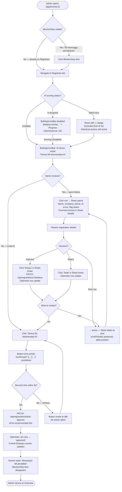
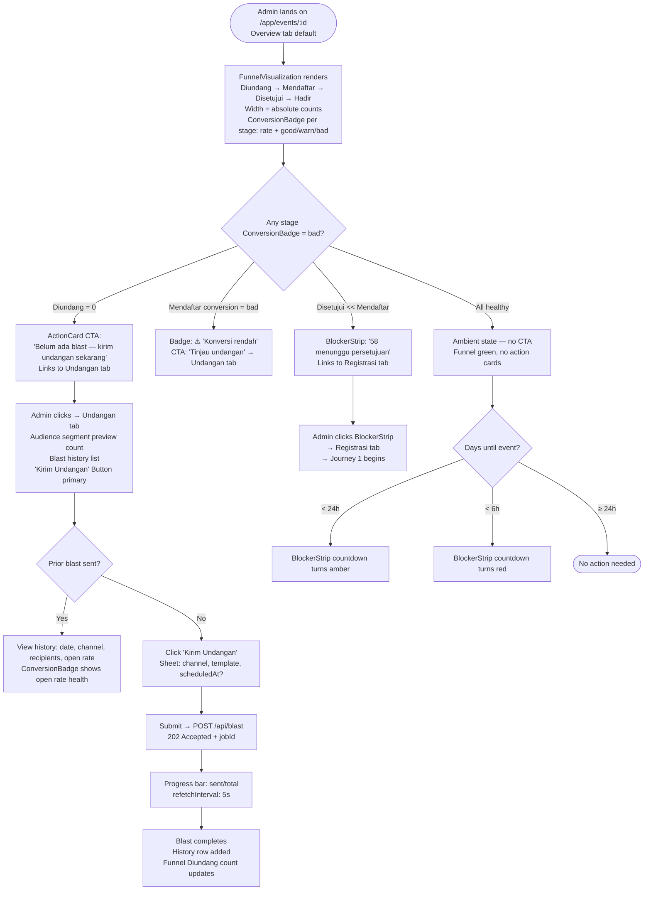
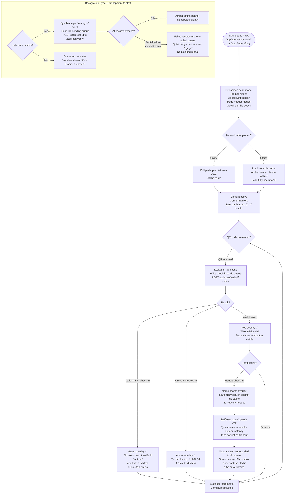

# UX Design Specification — Event Pipeline Hub

**Author:** Dian
**Date:** 2026-03-21

---

## Executive Summary

### Project Vision

Transform `/app/events/:id` from a configuration form into a **purposeful 6-tab pipeline workspace** — the Event Pipeline Hub — where admins manage the complete event lifecycle (blast → registration → approval → check-in → analytics) without context-switching between pages. The hub surfaces the right action at every stage of the funnel, making the admin always oriented and never hunting.

### Target Users

**Primary — Event Admin (desktop-first, high-pressure):**
Manages 5+ simultaneous events across 18 Indonesian cities. Works at lg breakpoint. Needs to scan pipeline health in under 5 seconds and act without hunting. Time-pressured; dashboards that require reading defeat the purpose. Success: event day runs without firefighting.

**Secondary — Staff (mobile-first, event-day, offline-resilient):**
Uses only the Check-in tab during live events. Operates on mobile PWA, potentially offline, scanning QR codes in rapid succession. Needs full-screen scan mode with zero admin chrome overhead. Success: check-in queue cleared within 15 minutes of event start for events up to 300 pax.

### Key Design Challenges

1. **Funnel continuity** — Admin must read pipeline health (blast → registration → approvals → attendance) in under 5 seconds without navigating. Overview tab must answer "where are we?" spatially, not numerically.
2. **Status-gated tab states** — Tabs irrelevant to the current event status (Konfirmasi, Check-in for a Draft event) must be clearly disabled with "available after publishing" tooltips — not confusingly empty.
3. **AI trust calibration** — "Terima Semua Rekomendasi AI" is a high-stakes bulk action affecting real humans. Admin must see what she's accepting before the button is active. Friction that reveals information is good friction.
4. **Dual-context Check-in tab** — Admin (desktop monitoring) and Staff (mobile scanning) share one URL but have fundamentally different UX needs. Same route, two fully different rendered views based on breakpoint.

### Design Opportunities

1. **Horizontal funnel visualization on Overview** — Show funnel stages as a narrowing visual (Diundang → Mendaftar → Disetujui → Hadir), not a KPI grid. Drop-off between stages is the insight — a visual cliff communicates in 2 seconds what a number delta communicates in 8.
2. **Progressive "next action" disclosure on Overview** — Ambient monitoring view when all is well; single highlighted CTA surfaces when "Perlu Tindakan" count > 0. One component, two modes.
3. **Clickable cross-tab status strip** — One line below the tab bar: 3 items (blast recency, pending approvals, countdown to event), every item a link to its tab. Ambient orientation without leaving the current workspace.
4. **AI trust confidence coloring** — Color-band the AI score column (green ≥0.8, amber 0.5–0.79, red <0.5) *distinctly* from contact flag badges (which indicate actively harmful contacts vs. low-fit scores). Two separate visual systems, never conflated.

---

## Core User Experience

### Defining Experience

**The ONE most frequent action:**
The admin's primary loop is: **open event → read pipeline state → act on the highest-priority item.** In practice, the Registrasi tab is where she spends the most time — reviewing the AI approval queue, bulk-approving the recommended list, then moving on. This happens multiple times per day in the days before an event.

**The critical interaction to get absolutely right:**
**Bulk AI approval.** This action approves real humans for a real event and triggers WhatsApp/email delivery to all of them. If the admin doesn't trust the AI recommendations, she reviews every row manually — destroying the automation value. If she over-trusts and approves flagged contacts, Yorindo's deliverability suffers. Getting this single interaction right is the product's core value proposition made real.

**What should be completely effortless:**
- Sending a blast from within the event (no navigating to a separate Blasts page)
- Reading pipeline health on Overview (5-second scan, no arithmetic)
- The staff scan loop on Check-in (scan → result covers screen → auto-dismiss → next, zero taps between scans)

### Platform Strategy

**Admin surface:** Desktop-first (`lg` breakpoint primary). Mouse + keyboard. Shadcn/ui Tabs component for navigation. Full tab bar + status strip visible. TanStack Table for registration queue (sortable, filterable, server-side paginated). React Query for live data with `staleTime: 60_000` on the shared overview query.

**Staff surface:** Mobile-first Check-in tab (`<lg` breakpoint). Touch-only. Tab bar hidden. Full-screen scan mode with `html5-qrcode`. Offline-resilient via IndexedDB + `idb`. Scan result overlay auto-dismisses after 1.5s — zero tap required between scans. `navigator.onLine` → amber offline banner when disconnected.

**Both surfaces:** Same URL (`/app/events/:id/*`). Same React component tree. Breakpoint-driven view split using `hidden lg:flex` / `block lg:hidden` Tailwind classes. No separate route or separate PWA entry point.

### Effortless Interactions

| Interaction | How it becomes effortless |
|---|---|
| Read pipeline state | Horizontal funnel visual on Overview — 2-second read, no arithmetic |
| Send blast | Pre-populated with event segment — one config form, one click |
| Bulk approve registrations | Inline summary bar shows score/flag breakdown before button activates — 2 clicks from load to done |
| QR scan loop | Auto-dismiss result overlay, no manual tap between scans |
| Orient across tabs | Clickable status strip (3 items) persists on every tab without breaking context |
| Recover from offline | Amber banner + queue count is unmissable; no admin action needed, syncs on reconnect |

### Critical Success Moments

1. **"I know what to do next" — Overview tab loads:** Admin opens the hub and sees the funnel. One item glows red: 47 pending approvals, event in 18 hours. She clicks the number. She's on the Registrasi tab. That's the moment.

2. **"I can trust this" — Bulk AI approve:** Inline summary bar: "47 direkomendasikan · 2 berpotensi masalah · 0 skor rendah." She deselects the 2 flagged. Summary updates: "45 direkomendasikan · 0 masalah." She clicks. Done in under 30 seconds. The automation worked.

3. **"The event runs itself" — Event day check-in:** Staff scans QR, green overlay fills screen: "✓ Amelia Hartono — Diizinkan masuk." 1.5 seconds. Next scan. Admin on desktop sees the counter: 147/200. No firefighting.

4. **"I didn't have to leave" — First blast from within the hub:** Admin is on the Undangan tab, audience preview shows 312 matched contacts, blast config form is pre-filled with event segment. She hits send. 202 Accepted. Still in the hub, same event.

### Experience Principles

1. **Pipeline orientation over information density** — At every moment, the admin should know where in the funnel her event sits. Spatial clarity trumps raw data completeness.

2. **Friction that reveals is good friction** — Pre-arm high-stakes bulk actions with summary counts. The goal isn't fewer clicks; it's clicks made with confidence.

3. **One URL, two rendering contexts** — Admin and staff share the same route. Breakpoint determines which experience renders. No separate apps, no separate bookmarks.

4. **Actions surface when needed, hide when not** — The Overview tab has two modes: ambient monitoring (event running fine) and action mode (something needs doing). Don't show the CTA unless the action is warranted.

5. **Context never breaks** — Blast, approval queue, ticket delivery, and check-in all live under one event. The admin builds a mental model of "her event" in one place. Navigating externally shatters that model.

---

## Desired Emotional Response

### Primary Emotional Goals

**Confident control** — not excitement, not delight. The admin should feel like she's running the event, not reacting to it. The hub should make her feel one step ahead of the funnel at every moment.

For staff on Check-in: **focused competence** — I know exactly what to do, the tool does not get in my way.

### Emotional Journey Mapping

| Moment | Desired feeling | Avoid |
|---|---|---|
| Opens Overview | "I see exactly where I stand" — oriented, calm | Overwhelmed by dense KPIs |
| Sees pending approvals on Overview | "I know what to act on" — focused, purposeful | Anxious, scattered |
| Uses bulk AI approve on Registrasi | "I trust this enough to commit" — confident, relieved | Skeptical, second-guessing |
| Sends blast from Undangan tab | "That was fast — I didn't have to leave" — efficient, pleasantly surprised | Frustrated by unnecessary navigation |
| Event day Check-in (staff) | "I just need to scan, nothing else" — focused, competent | Confused by admin chrome she doesn't need |
| Sees scan confirmed: "✓ Diizinkan masuk" | "This works — I can trust it" — relieved | Anxious about whether the scan registered |
| Sees offline banner appear | "I know what's happening — I'm still in control" — informed, calm | Panicked, uncertain |

### Micro-Emotions

- **Trust over skepticism** — Especially on AI-assisted actions. Every design choice on the Registrasi tab must build toward "I believe this recommendation."
- **Efficiency over delight** — This is an ops tool, not a consumer app. Delightful animations have no place here. Efficiency — task done, no friction — *is* the delight.
- **Informed over surprised (bad)** — Offline mode, slow loads, bulk actions in progress — the admin must always know what's happening. Uncertainty creates anxiety.

**Emotions to actively avoid:**
- **Overwhelm** — too many equal-weight items competing for attention on Overview
- **Doubt** — after bulk approving, admin wonders "did it go through?" (need success toast + count update)
- **Frustration** — navigating away from the hub to complete a task that should live there
- **Panic** — staff offline, no indicator, scans silently failing

### Design Implications

| Emotion target | UX approach |
|---|---|
| Confident control | Horizontal funnel as the first element on Overview; nothing else competes for dominance |
| Trust in AI | Inline summary bar + color bands + exact-ID submit; admin *sees* what she's approving before she approves it |
| Efficient, no friction | Blast form pre-filled with event segment; no round-trip to a Blasts page |
| Informed, not surprised | Every async action (blast queued, bulk approve submitting, scan syncing) has immediate visual feedback: toast + optimistic state update |
| Staff: focused competence | Tab bar hidden on mobile Check-in; scan viewfinder fills the screen; result overlay is the only element that matters |
| Calm during offline | Amber banner with queue count ("3 scan tersimpan — akan disinkronkan saat online") is informative, not alarming |

### Emotional Design Principles

1. **Control is the primary feeling, not delight** — Every design decision asks: does this help the admin feel in command of her event? Not: is this beautiful?
2. **Feedback closes the loop** — Every action the admin takes must have an immediate visible response. Silent success is silent failure from the admin's perspective.
3. **Reduce uncertainty, not steps** — Sometimes more steps that are clear beat fewer steps that leave doubt. The bulk approve summary bar adds a step; it removes doubt.
4. **Staff's context is sacrosanct** — On mobile Check-in, the scan loop is the entire experience. Any admin chrome that appears on mobile is a failure.

---

## UX Pattern Analysis & Inspiration

### Inspiring Products Analysis

**Linear** — ambient status language, keyboard-first feedback, filters as first-class citizens.

**Vercel** — deployment detail page as structural reference; live data streaming; clear pass/fail visual states. *Refined: Vercel's strict sequential model doesn't fit — event lifecycle stages are concurrent, not gated.*

**Notion** — multi-select + bulk action bar pattern; property-level color coding; inline editing feels instant. *Refined: Notion's hidden floating bar suits knowledge workers; ops admins need always-visible anchored actions.*

**Stripe** — funnel-first hero layout; event log as primary trust-builder; time-series context on hover.

**GitHub PR tabs** — concurrent facets of one thing (Overview, Commits, Checks, Files Changed); tabs are simultaneous lenses, not sequential gates → **refined mental model for the Event Pipeline Hub.** The admin's mental model is campaign phases, not a pipeline waterfall.

### Transferable UX Patterns

**Navigation:**
- GitHub PR tabs → Hub's 6-tab structure: concurrent campaign phase facets, not pipeline gates
- Persistent blocker strip (GitHub PR merge checklist) → 3-item strip below tab bar; items appear when actionable; countdown always visible, color-shifts amber at <24h, red at <6h; single `BlockerState` endpoint
- Status-gated disabled tabs with tooltips (Linear) → Hub tabs unavailable for draft events

**Interaction:**
- Always-visible anchored button with dual modes (adapted from Notion): AI-driven mode ("Terima 47 rekomendasi AI") when no rows selected; manual selection mode ("Setujui 12 terpilih") when rows checked — same `<BulkApproveBar>` component, two label states
- Inline summary bar before bulk approve activates (adapted from Stripe batch ops): score distribution + flag count visible before the action commits
- Auto-dismiss scan result overlay (custom): full-screen result, 1.5s auto-dismiss, zero taps between scans

**Visual:**
- Horizontal funnel narrowing left-to-right (Stripe) → Overview tab hero
- Color-band score column: green ≥0.8 / amber 0.5–0.79 / red <0.5 (Linear priority colors) — visually distinct from contact flag badges
- Amber offline banner, non-blocking → Check-in offline state

### Anti-Patterns to Avoid

- **Modal confirmation for common actions** — use inline summary bars for high-frequency reversible actions; reserve `AlertDialog` for irreversible/high-consequence actions only (event cancellation, bulk reject all)
- **12 equal-weight KPIs on Overview** — replaced by spatial funnel visualization with clear hierarchy
- **Navigation away from event context** — all blast, approval, check-in, and analytics work stays under `/app/events/:id`
- **Silent async operations** — every submitted action fires a toast + optimistic state update immediately, before server response
- **Admin chrome on mobile Check-in** — tab bar hidden at `<lg` breakpoint; scan viewfinder is the entire experience

### Design Inspiration Strategy

**Adopt directly:**
- GitHub PR tab structure → 6 concurrent-phase tabs
- Stripe funnel hero → Overview tab opening layout
- Notion property color-coding → AI score column bands

**Adapt:**
- Notion's floating action bar → always-visible anchored dual-mode button (AI-driven / manual selection)
- Linear's ambient status → blocker strip (actionable, not passive; items appear when relevant)
- Vercel's live data streaming → real-time scan counter + blast progress (React Query `refetchInterval`)

**Invert intentionally:**
- Modal = severity signal, not friction tax — `AlertDialog` for event cancellation and bulk reject all; inline summary bar for everything else
- Reversibility determines UI pattern, not action frequency

---

## Design System Foundation

### Design System Choice

**shadcn/ui** (Radix UI primitives + Tailwind CSS utility classes) — already established in the codebase per architecture.md and the Contacts Intelligence Hub spec. The Event Pipeline Hub must be visually and behaviorally consistent with the existing admin surface.

### Rationale for Selection

1. **Already in the codebase** — `yorindo-app` uses shadcn/ui from day one per the architecture scaffold. Not a new decision.
2. **Component coverage for all hub patterns** — `Tabs`, `Table`, `Badge`, `AlertDialog`, `Sheet`, `Skeleton`, `ScrollArea`, `Collapsible`, `Alert`, `Popover`, `Button`, `Progress` cover every pattern identified in steps 3–5.
3. **Accessibility built in** — Radix UI primitives handle ARIA, keyboard navigation, focus trapping (Sheet/AlertDialog), and screen reader announcements. WCAG 2.1 AA compliance inherited.
4. **Tailwind-first responsive** — `hidden lg:flex` / `block lg:hidden` breakpoint split already proven in contacts spec. Same strategy applies to Check-in tab dual-context rendering.
5. **No custom CSS drift** — Every pattern maps to an existing shadcn component. No one-off styled divs where a component exists.

### Implementation Approach

**New shadcn components required (not yet in contacts spec):**

| Component | Use | Install |
|---|---|---|
| `Tabs` | 6-tab hub navigation | `npx shadcn@latest add tabs` |
| `Progress` | Blast send progress bar | `npx shadcn@latest add progress` |
| `AlertDialog` | Event cancellation, bulk reject all | `npx shadcn@latest add alert-dialog` |

**Custom components with no shadcn equivalent:**

| Custom Component | Description | Built from |
|---|---|---|
| `<FunnelVisualization>` | Horizontal narrowing funnel on Overview | `div` + Tailwind widths |
| `<BlockerStrip>` | 3-item clickable status strip below tab bar | `div` + shadcn `Button variant="link"` |
| `<BulkApproveBar>` | Always-visible dual-mode approve button + inline summary | `div` + shadcn `Button` + `Badge` |
| `<ScanResultOverlay>` | Full-screen auto-dismiss scan result on Check-in mobile | `div` + Tailwind + `useEffect` timer |
| `<AiScoreBadge>` | Color-banded AI score display | shadcn `Badge` with computed `className` |

### Customization Strategy

- **Score band colors:** `green-600` (≥0.8), `amber-600` (0.5–0.79), `red-600` (<0.5) — applied as computed `className` on `<AiScoreBadge>`, never conflated with flag badge colors
- **Flag badge colors:** `red-700` (spam/not-potential), `orange-600` (other flags) — distinct from score bands
- **Offline/event banners:** `amber-50` background, `amber-200` border, `amber-900` text — consistent with existing `EventBanner` in contacts spec
- **Countdown urgency:** `text-muted-foreground` (>24h), `text-amber-700` (<24h), `text-red-700` (<6h) in BlockerStrip
- **Typography + spacing:** no changes — existing `text-sm`/`text-xs`/`font-medium`/`text-muted-foreground` hierarchy; `p-6` page padding, `mb-4`/`mb-6` section rhythm

---

## 2. Core User Experience

### 2.1 Defining Experience

> "See the funnel, act on the queue, trust the AI, never leave the event."

The defining experience is the **AI-assisted approval loop**: admin sees funnel drop-off on Overview → clicks blocker strip item → lands on Registrasi tab → reads inline summary bar → optionally reviews contacts via Sheet → hits bulk approve (double-click confirmation) → funnel counter updates. Target: under 60 seconds for ≤80 registrations.

### 2.2 User Mental Model

**Current approach (manual):** Admin downloads a CSV of registrations, cross-references against a contacts spreadsheet, marks approved/rejected manually, re-uploads. 30–60 minutes per approval round per event.

**Mental model they bring:** They expect a table. They expect to read rows. They expect to click one at a time. The hub must earn bulk-approve trust progressively — first time they'll review every row, second time they'll scan the summary bar, third time they'll bulk accept if the numbers look right.

**Confusion points resolved:**
- "Is 0.73 a good score?" → color bands answer visually (amber = borderline)
- "What does this flag mean?" → distinct flag badge with tooltip (spam / not-potential)
- "Did it actually send?" → toast + optimistic counter update fires before server response
- "Can I undo this?" → clear answer: no batch undo; double-click confirmation gives 3-second exit before commitment

### 2.3 Success Criteria

| Criterion | Measure |
|---|---|
| Speed | Approval round complete in <60s for ≤80 registrations |
| Trust adoption | Admin uses bulk approve (not row-by-row) by second event using the hub |
| Confidence | Zero "did it go through?" moments — every action has immediate visual confirmation |
| Zero context-switch | Admin never navigates outside `/app/events/:id` to complete the approval loop |
| AI adoption | ≥50% of approval sessions use bulk approve over individual row actions |

### 2.4 Novel vs. Established Patterns

**Established (use directly):** Table multi-select, toast notifications, badge/chip status labels, Sheet slide-over.

**Adapted (familiar metaphor, new behaviour):**
- Dual-mode approve button (AI-driven / manual selection) — self-describing label makes the mode switch obvious
- Inline summary bar — "review your cart before checkout" metaphor; familiar from e-commerce, novel in an approval workflow
- Double-click confirmation — button *becomes* the confirmation; no modal dialog

**Novel (one-time tooltip on first visit):**
- Color-banded AI score column — tooltip on first render: "Skor AI: hijau = tinggi, kuning = sedang, merah = rendah"
- Blocker strip — learned through repeated use, not instruction

### 2.5 Experience Mechanics — The Approval Loop

**Initiation:** BlockerStrip shows "62 menunggu persetujuan · Event dalam 2 hari" (amber). Admin clicks item → lands on Registrasi tab.

**AI scoring states (three modes):**
- *Complete:* BulkApproveBar shows full AI recommendation count; bulk approve enabled
- *In progress:* BulkApproveBar shows "Penilaian AI sedang berjalan... (42/62 selesai)" with `<Progress>` bar; bulk approve button disabled; individual row approve/reject actions remain live; `refetchInterval: 10_000` polls until complete
- *Failed on some rows:* Affected rows show `<Badge variant="destructive">Gagal dinilai</Badge>`; excluded from AI recommendation list automatically; admin reviews manually

**Interaction:** BulkApproveBar (AI mode): "Terima 58 rekomendasi AI." Inline summary: "58 direkomendasikan · 0 berpotensi masalah · 4 skor rendah tidak termasuk." Admin can click any row name → Sheet opens (right side panel) containing: contact detail (name, company, title, city, completeness score, flag status, past event history) + Setujui/Tolak action buttons in Sheet footer + prev/next navigation arrows in Sheet header to walk through rows without closing and reopening.

**Confirmation (double-click pattern):** First click on BulkApproveBar → button turns amber, label becomes "Konfirmasi? (3...)" with countdown fill animation. Second click = committed, `POST /api/registrations/bulk-approve` fires. Timeout (3s) = auto-cancelled, button returns to idle. Entirely client-side — no request sent until second click.

**Feedback:** Optimistic update fires immediately on second click: rows flip to "approved" status badges. Toast: "58 kontak disetujui — tiket sedang dikirim." BlockerStrip updates: "4 menunggu persetujuan." Funnel counter on Overview refreshes on next React Query refetch.

**Completion:** Admin returns to Overview. Funnel shows 58 Disetujui. The job is visibly done.

**Cross-event scope note:** This hub manages one event deeply. Cross-event urgency prioritisation (which event to tackle first across 5 simultaneous events) is handled at the events list page (`/app/events`) via per-event urgency badges — a dependency for a future story, not in scope for this hub.

---

## Visual Design Foundation

### Color System

Extends the existing Tailwind + shadcn/ui token system. No new colors introduced. Every role maps to an existing token or semantic Tailwind class already used in the contacts spec.

**Semantic color roles:**

| Role | Token | Usage |
|---|---|---|
| Primary action | `bg-primary` / `text-primary-foreground` | Bulk approve, send blast, publish event |
| Destructive | `bg-destructive` / `text-destructive-foreground` | AlertDialog confirm (cancel event, bulk reject) |
| Muted / secondary | `text-muted-foreground` | Timestamps, secondary labels, empty states |
| Success | `green-600` / `green-50` bg | AI score ≥0.8, scan success overlay |
| Warning / amber | `amber-600` / `amber-50` bg | AI score 0.5–0.79, offline banner, countdown <24h, double-click confirmation state |
| Danger / red | `red-600` / `red-50` bg | AI score <0.5, flag badges, countdown <6h, scan reject overlay |
| Info strip | `amber-50` bg / `amber-200` border / `amber-900` text | BlockerStrip actionable state; EventBanner (consistent with contacts spec) |
| Neutral border | `border` (CSS var) | Cards, table rows, Sheet, dividers |

**Two visually distinct systems — never conflated:**
- **AI score bands:** green/amber/red on `<AiScoreBadge>` — communicates *fit* (low score ≠ harmful contact)
- **Flag badges:** `red-700` (spam, not-potential), `orange-600` (other flags) with icon — communicates *risk* (actively problematic contact)

**Funnel visualization:** Stage bars use `bg-primary` with decreasing opacity (100% → 75% → 50% → 25%) to show narrowing. Drop-off conversion percentages in `text-muted-foreground` below each stage arrow.

### Typography System

Inherits existing type scale — no new fonts, no new sizes. The hub is an ops tool; scanning density matters more than typographic expression.

| Element | Class | Usage |
|---|---|---|
| Event title | `text-2xl font-bold` | Hub header |
| Tab labels | `text-sm font-medium` | Tab bar navigation |
| Section headings | `text-sm font-semibold` | Card headers, table section titles |
| Table content | `text-sm` | Registration rows, contact names |
| Supporting text | `text-xs text-muted-foreground` | Timestamps, score values, BlockerStrip items |
| Inline summary bar | `text-sm font-medium` + `text-muted-foreground` | BulkApproveBar summary |
| Toast | Sonner defaults | Action confirmations |

**Density principle:** Approval table uses `text-sm` rows + `py-2` cell padding. It is a scanning experience, not a reading experience.

### Spacing & Layout Foundation

**Base unit:** 4px (Tailwind default).

**Page shell (top to bottom):**
```
[Event Header — name, status badge, quick-action button]
[Tab Bar — 6 tabs, full width]
[BlockerStrip — 1 line, conditional, full width]
[Tab Content Area — p-6 padding]
```

**Tab content — desktop (`lg+`):**
- Overview: `lg:grid-cols-[2fr_1fr]` — funnel left, action card right
- Registrasi: full-width table, BulkApproveBar pinned above with `gap-4`
- Undangan, Konfirmasi: Card-based, `gap-6` between sections
- Check-in (desktop): 2-column — live counter + stats left, scan log right
- Laporan: Epic 8 placeholder layout

**Tab content — mobile (`<lg`):**
- All tabs: single column, full width
- Check-in tab: **full-screen scan mode** — tab bar, BlockerStrip, page header all `hidden`; viewfinder + result overlay fill `100vh`

**Component rhythm:** section gap `mb-6`, card padding `p-4`/`p-6`, table cell `py-2 px-4`, BlockerStrip `py-2 px-6` (single line, no wrapping).

### Accessibility Considerations

- **Color + text, never color alone:** Score bands show both color and symbol (`0.82 ✓` green, `0.61 ~` amber, `0.34 ✗` red). Flag badges use icon + color + text label.
- **Contrast:** All text/background pairs meet WCAG 2.1 AA (4.5:1 minimum).
- **Keyboard navigation:** Radix Tabs (arrow keys), Sheet focus trap, AlertDialog focus trap, BulkApproveBar always in tab order.
- **Touch targets:** All interactive elements ≥44×44px on mobile Check-in. Scan result auto-dismisses via timer — no accidental tap dismissal.
- **Live announcements:** `aria-live="assertive"` on scan result overlay ("Diizinkan masuk — [Name]"). `role="status"` + `aria-live="polite"` on BlockerStrip and offline banner.
- **Reduced motion:** Countdown fill animation respects `prefers-reduced-motion` — falls back to static amber button with "Konfirmasi?" label.

---

## Design Direction Decision

### Design Directions Explored

Five directions were generated and evaluated against the established design foundation:

| Direction | Name | Core Idea |
|---|---|---|
| **A** | Command Bridge | Horizontal funnel bars in Overview, amber action card, prominent BlockerStrip anchored below full-width tab bar |
| **B** | Focused Pipeline | Vertical sidebar nav (event stages as sidebar items), wider main content area optimized for tables |
| **C** | Cards First | Overview shows 3 pipeline stage cards (Blast, Registrasi, Konfirmasi) — highlight the blocked card |
| **D** | Compact Ops | Entry point is Registrasi table. Dense rows, BulkApproveBar pinned top, live double-click confirm demo |
| **E** | Check-in Mobile | Phone frame showing full-screen staff scan UX — offline banner, viewfinder, green success overlay, stats bar |

### Chosen Direction

**Composite: A (Command Bridge) as primary shell + D (Compact Ops) table interaction patterns + E (Check-in Mobile) for the mobile scan context.**

No single direction covers all 6 tabs — the hub is multi-context by design. The chosen composite:

- **A** provides the overall page architecture: Event header → Tab bar → BlockerStrip → content area. This matches the "GitHub PR tabs" mental model established in Step 5. The horizontal funnel visualization on Overview and the amber action card are both pulled from Direction A.
- **D** provides the Registrasi tab interaction model: dense scan-optimized table, BulkApproveBar pinned above table, double-click confirmation mechanics (idle → amber countdown → committed). Direction D's density-first philosophy matches the "under 60 seconds for ≤80 registrations" performance target.
- **E** provides the Check-in mobile context: tab bar hidden, viewfinder fills `100vh`, auto-dismiss scan result overlay, offline amber banner. This is a complete context switch within the same URL — not a scaled-down version of the desktop view.

Direction B was ruled out because vertical sidebar nav competes with the main navigation and reduces content width unnecessarily. Direction C was ruled out because card-first Overview conceals the funnel drop-off — the key insight — behind a card metaphor; horizontal funnel bars (Direction A) communicate drop-off spatially in 2 seconds.

### Design Rationale

**Why the Command Bridge shell works for the admin persona:**
The admin manages 5+ simultaneous events under time pressure. Direction A's layout prioritizes spatial orientation: one glance at the header shows event status and days remaining; one glance at the BlockerStrip shows the 3 most actionable items. The tab bar is always visible, so switching from Overview to Registrasi is a single click with no navigational overhead.

**Why Compact Ops wins for the approval table:**
The defining experience (the AI-assisted approval loop) is a table-centric task. "Review 58 registrations, bulk approve in 60 seconds" requires dense rows, visible AI scores on every row, and the BulkApproveBar always in viewport. Direction D's model — where the table is the feature, not a secondary component inside a card — is the right hierarchy.

**Why the Check-in tab is Direction E, not a responsive version of A:**
Staff context at event-day is categorically different from admin context. Staff need full attention on the camera feed — no chrome, no distractions, immediate feedback. A responsive version of the Command Bridge would still show the BlockerStrip, tab labels, and page header, all consuming viewfinder space. Direction E's full-screen scan mode is not a style choice — it's a safety property (staff must not look away from the viewfinder to find a button).

### Implementation Approach

The composite direction maps to component responsibilities:

| Hub Area | Direction Source | Key Components |
|---|---|---|
| Page shell | A — Command Bridge | `<EventHubLayout>`: header, `<Tabs>`, `<BlockerStrip>` |
| Overview tab | A — horizontal funnel | `<FunnelVisualization>`, `<ActionCard>`, `<PipelineStats>` |
| Registrasi tab | D — Compact Ops | `<TanStackTable>` + `<BulkApproveBar>` (dual-mode), `<AiScoreBadge>`, `<ContactSheet>` |
| Undangan tab | A — card sections | Blast history list + `<BlastConfigForm>` |
| Konfirmasi tab | A — card sections | Stat cards + resend controls |
| Check-in (desktop) | A — 2-column | Live counter + scan log |
| Check-in (mobile) | E — full-screen scan | `<ScanViewfinder>`, `<ScanResultOverlay>`, offline banner |
| Laporan tab | A — placeholder | Epic 8 Suspense boundary |

Tab bar is always Direction A (Radix `Tabs`, full-width, 6 items). The content area below morphs per tab — the outer shell never changes.

---

## Cross-Cutting Implementation Standards

> These constraints apply to every component, story, and code artifact in this spec.

**UI Component Library:** shadcn/ui exclusively. No mixing with other component libraries. All primitives — Button, Sheet, Tabs, Table, AlertDialog, Badge, Card, Toast (Sonner), Progress, Dialog, Command — come from shadcn/ui. Custom components (`<FunnelVisualization>`, `<BlockerStrip>`, `<BulkApproveBar>`, `<AiScoreBadge>`, `<ScanResultOverlay>`) are built on top of shadcn/ui primitives, never alongside competing libraries.

**SE Design Patterns:** All backend code follows the patterns established in `architecture.md`:
- **Repository Pattern:** All data access via `IRepository` interfaces; concrete implementations (`InMemoryXRepository`, `PostgresXRepository`) resolved through `src/container.ts`
- **Service Adapter Pattern:** All external service calls via `IService` interfaces; mock implementations in Phase 1, real adapters in Phase 2
- **Dependency Injection:** Route handlers and services import only interface types, receive concrete implementations via `src/container.ts`
- **Interface-first typing:** No concrete class names leak into feature code — only interface types

Any deviation from these standards in code review, spec review, or story implementation is a blocker, not a suggestion.

---

## User Journey Flows

### Cross-Journey Design Decisions (Party Mode Resolutions)

Before the flows: four architectural decisions resolved during review that apply across journeys.

| Decision | Resolution |
|---|---|
| **Registrasi scroll preservation** | Load all ≤80 registrations client-side (no server pagination on Registrasi tab). `scrollToIndex(lastReviewedIndex, { align: 'center' })` on Sheet close via `virtualizer` ref. Transient `ring-1 ring-primary/30` row highlight (3s) as fallback. `overscan: 5` minimum. |
| **Funnel drop-off interpretation** | Funnel width = absolute counts. Add `<ConversionBadge>` per stage transition showing rate + `good/warn/bad` vs. `lib/benchmarks.ts` constants. CTA card triggers on `bad` health only — not on visually narrow funnel. Benchmarks configurable by event type (future). |
| **Staff check-in entry point** | Direct URL (`/app/events/:id/checkin`) bypasses Radix disabled tab by design. BE enforces `EVENT_NOT_LIVE` error on scan if event not in `live` status. Scan overlay shows friendly wait state. Dedicated staff deep link (`/scan/:eventSlug`) is a future story (Epic 7). |
| **Offline sync conflicts** | `POST /api/scan/verify` is fully idempotent — duplicate scans return `{ success: true, alreadyAttended: true }`, never a 409. Eliminates the duplicate conflict class. Background Sync API (`SyncManager`) handles automatic flush — no button, no manual trigger. Failed records (invalid token) surface as quiet badge on stats bar only. |

---

### Journey 1 — AI-Assisted Approval Loop

**Actor:** Event Admin | **Entry:** Overview tab or direct BlockerStrip click | **Goal:** Process registration queue in under 60 seconds for ≤80 registrations

**shadcn/ui components:** `Tabs`, `Sheet`, `Button`, `Badge`, `Table` (TanStack Table rows), `Sonner` toast, `Progress`



---

### Journey 2 — Blast to Registration Funnel Monitoring

**Actor:** Event Admin | **Entry:** `/app/events/:id` (default Overview tab) | **Goal:** Situational awareness in under 5 seconds; one-click to resolution

**shadcn/ui components:** `Card`, `Badge`, `Button`, `Progress`, `Tabs`; custom `<FunnelVisualization>`, `<ConversionBadge>`, `<BlockerStrip>`



---

### Journey 3 — Staff Event-Day Check-in (Offline-First)

**Actor:** Event Staff | **Entry:** Mobile PWA, direct URL or `/scan/:eventSlug` deep link | **Goal:** Process ≤300 pax in 15 minutes; zero dependency on connectivity

**shadcn/ui components:** `Button` (manual search), `Input` (name search); custom `<ScanViewfinder>`, `<ScanResultOverlay>`, `<StatsBar>`; all chrome (Tabs, BlockerStrip, header) hidden on mobile

**Offline strategy:** Fully offline-first via idb + Background Sync API (`SyncManager`). No manual sync button. No sync banner interaction. Connectivity is treated as unreliable by default.



**Key offline-first properties:**
- idb is the source of truth for check-in state during the event — not the server
- Every scan (QR or manual) writes to idb immediately, independently of network
- Background Sync fires automatically when connectivity returns — staff never triggers it
- `POST /api/scan/verify` is idempotent: duplicate scans across devices return `alreadyAttended: true`, never a conflict error
- Failed queue (invalid tokens) surfaces as stats bar badge only — staff can continue scanning without interruption

---

### Journey Patterns

| Pattern | Journey | Mechanism |
|---|---|---|
| **BlockerStrip as nav accelerator** | 1, 2 | Always-visible strip drives cross-tab navigation without admin having to remember where action lives |
| **Optimistic update + toast** | 1, 2 | Write to UI immediately; server confirmation via toast; rollback on error with error toast |
| **Context-sensitive full-screen mode** | 3 | Same URL renders admin monitoring (`lg+`) or staff scan mode (`<lg`) based on breakpoint — chrome fully hidden for staff |
| **idb-first write path** | 3 | All writes go to idb immediately; network is a sync target, not a dependency |
| **Ambient → actionable CTA** | 2 | Overview idle = clean ambient view; CTA surfaces only when `ConversionBadge = bad` — no noise when pipeline is healthy |

### Flow Optimization Principles

| Principle | Mechanism |
|---|---|
| Steps to value | Approval loop: ≤4 clicks (BlockerStrip → tab → BulkApproveBar → double-click confirm) |
| Friction reveals information | Double-click 3s countdown shows exactly what will be committed before commit |
| Ambient over interrupting | BlockerStrip always visible, never a modal; admin acts on their schedule |
| Error recovery without dead-ends | Invalid QR → manual name search (KTP) → approve; no dead state, no OTP dependency |
| Offline-first resilience | idb write path is always available; Background Sync is automatic; staff UX never blocks on connectivity |
| Healthy baseline visible | ConversionBadge makes "this is expected" legible — admin reads campaign health, not just raw numbers |

---

## Component Strategy

### Design System Foundation — shadcn/ui (Exclusive)

All UI primitives come from shadcn/ui. No mixing with other component libraries. Custom components are compositions of shadcn/ui primitives + Tailwind utilities only.

| Component | Used In | Notes |
|---|---|---|
| `Tabs` | Hub shell — all 6 tabs | Radix-based; disabled prop for status-gated tabs |
| `Sheet` | ContactSheet (Registrasi review) | Slide-over with prev/next navigation |
| `Button` | All primary/secondary actions | Variant system: `default`, `outline`, `ghost`, `destructive` |
| `Badge` | Status badges, flag badges | Custom variant classes for AI score bands |
| `Card` / `CardHeader` / `CardContent` | Overview, Undangan history, Konfirmasi stats | |
| `Table` | Registrasi table (TanStack rows inside) | shadcn/ui Table as shell; TanStack for sort/filter/virtual |
| `AlertDialog` | Event cancellation, bulk reject all only | Irreversible actions with high blast radius |
| `Progress` | Blast send progress, AI scoring in-progress | |
| `Sonner` | All action confirmations (toast) | |
| `Input` | Manual check-in name search | |
| `Command` | Fuzzy name search combobox (idb cache) | |
| `Tooltip` | Disabled tab explanations | |
| `Skeleton` | Laporan placeholder, loading states | |

### Custom Components

Five custom components. All built on shadcn/ui primitives — no third-party additions.

#### `<FunnelVisualization>`
**Purpose:** Communicates blast → registration → approval → attendance pipeline health spatially. Drop-off is visible as narrowing bar width — readable in 2 seconds.

**Anatomy:**
```
[Diundang   ████████████████████ 2,000]  [ConversionBadge]
[Mendaftar  ████████████          400]   [ConversionBadge ✓ 20%]
[Disetujui  ███████               280]   [ConversionBadge ✓ 70%]
[Hadir      ████                  140]   [ConversionBadge — live]
```

**States:** Default (proportional bars), zero stage (thin `min-w-[4px]` line + CTA link), event-not-started (Hadir dashed outline).

**`<ConversionBadge>` sub-component:** `health: 'good' | 'warn' | 'bad' | 'pending'` → renders `✓ 20%` green / `~ 12%` amber / `✗ 4%` red / `—` pending. Benchmark thresholds from `lib/benchmarks.ts`. CTA card triggers only on `bad` health — not on visually narrow funnel.

**Accessibility:** Each bar: `role="meter"`, `aria-valuenow`, `aria-label="Diundang: 2000 undangan"`.

**Built on:** Tailwind width utilities + shadcn/ui `Badge`.

---

#### `<BlockerStrip>`
**Purpose:** Always-visible 1-line ambient status below tab bar. Up to 3 clickable items linking directly to the relevant tab. Color-shifts by urgency.

**States:**
- Default: `bg-muted` neutral strip
- Countdown < 24h: `bg-amber-50 border-amber-200`
- Countdown < 6h: `bg-red-50 border-red-200`
- No items: `hidden` (zero height, no layout shift)

**Data:** Shared `BlockerState` React Query — `staleTime: 60_000`. No spinner; stale data shown while revalidating.

**Accessibility:** `role="status"`, `aria-live="polite"`.

**Built on:** shadcn/ui `Button variant="ghost" size="sm"` per item.

---

#### `<BulkApproveBar>`
**Purpose:** Pinned above Registrasi table. Dual-mode: AI-driven (no selection) ↔ manual selection (rows checked). Same component instance, two rendered states.

**Mode 1 — AI-driven:**
```
[Terima 58 rekomendasi AI]  [58 direkomendasikan · 0 berpotensi masalah]
```
Double-click confirmation: idle → amber outline + 3s countdown fill → committed. Timeout → resets silently.

**Mode 2 — Manual selection:**
```
[Setujui 12 terpilih]  [Tolak 12 terpilih]  [12 baris dipilih ✕]
```

**AI scoring in-progress:** Button `disabled`, `Progress` bar + "Sedang menilai…". `refetchInterval: 10_000`.

**Reduced motion fallback:** Static amber button + "Konfirmasi?" label; no fill animation.

**Accessibility:** `aria-label` updates on state change. Countdown: `aria-live="assertive"`.

**Built on:** shadcn/ui `Button`, `Progress`, `Badge`.

---

#### `<AiScoreBadge>`
**Purpose:** Per-row AI suitability score in Registrasi table. Separate visual system from contact flag badges — never conflated.

| Score | Color | Symbol | Render |
|---|---|---|---|
| ≥ 0.80 | `text-green-700 bg-green-50` | `✓` | `✓ 0.92` |
| 0.50–0.79 | `text-amber-700 bg-amber-50` | `~` | `~ 0.61` |
| < 0.50 | `text-red-700 bg-red-50` | `✗` | `✗ 0.34` |
| Failed | `text-gray-500 bg-gray-100` | `⚠` | `⚠ Gagal` |
| Pending | `text-gray-400 bg-gray-50` | `…` | `… Menilai` |

Contact flag badges (`spam`, `not-potential`) always use dark saturated backgrounds (`bg-red-700`, `bg-orange-600`) — visually distinct from score bands' light backgrounds.

**Built on:** shadcn/ui `Badge` with custom variant classes.

---

#### `<ScanResultOverlay>`
**Purpose:** Full-screen scan feedback on mobile check-in. Auto-dismisses 1.5s. Three variants: success (green), already-attended (amber), invalid (red).

**Anatomy:** Large icon + primary text + secondary text (participant name/company). Invalid variant only: "Cari manual" `Button` → opens `<Command>` name search (KTP flow).

**Auto-dismiss:** `setTimeout(onDismiss, 1500)`. No tap required. Reduced motion: instant appear/disappear, no fade.

**Accessibility:** `role="alert"`, `aria-live="assertive"` — announced immediately.

**Built on:** Tailwind position utilities + shadcn/ui `Button`, `Command`.

---

### File Structure

```
src/components/
  hub/
    EventHubLayout.tsx       ← tab shell, header, BlockerStrip slot
    BlockerStrip.tsx
    FunnelVisualization.tsx
    ConversionBadge.tsx
  registrasi/
    BulkApproveBar.tsx
    AiScoreBadge.tsx
    ContactSheet.tsx         ← shadcn Sheet + prev/next + scrollToIndex
  checkin/
    ScanViewfinder.tsx
    ScanResultOverlay.tsx
    ManualCheckinSearch.tsx  ← Command + idb fuzzy search
  ui/                        ← shadcn/ui generated (untouched)
```

### Implementation Roadmap

| Priority | Components | Unblocks |
|---|---|---|
| 1 | `EventHubLayout`, `BlockerStrip`, `Tabs`, `Tooltip` | All tab development |
| 2 | `BulkApproveBar`, `AiScoreBadge`, `ContactSheet`, `Sheet`, `Progress`, `Sonner` | Defining experience (approval loop) |
| 3 | `FunnelVisualization`, `ConversionBadge`, `Card`, blast `Progress` | Overview + Undangan tabs |
| 4 | `ScanViewfinder`, `ScanResultOverlay`, `ManualCheckinSearch`, `Command` | Check-in mobile |
| 5 | `Skeleton` + Suspense boundary, Konfirmasi `Card`/`Badge`/`Button` | Konfirmasi + Laporan stub |

---

## UX Consistency Patterns

### Button Hierarchy

Three action classes. Every button maps to exactly one.

| Class | shadcn/ui Variant | Rule | Examples |
|---|---|---|---|
| **Primary** | `variant="default"` | One per view maximum | "Terima rekomendasi AI", "Kirim Undangan", "Publikasikan" |
| **Secondary** | `variant="outline"` | Supporting actions on same view | "Setujui", "Tolak", "Kirim Ulang Tiket" |
| **Ghost / Utility** | `variant="ghost"` | Navigation, dismiss, low-stakes | BlockerStrip items, "Batal", Sheet prev/next arrows |
| **Destructive** | `variant="destructive"` | Irreversible only; always inside `AlertDialog` | "Batalkan Event", "Tolak Semua" |

**Rules:** Never two `variant="default"` visible simultaneously at the same level. Destructive actions never standalone — always gated by `AlertDialog`. `BulkApproveBar` confirming state uses `variant="outline"` + amber border — the only custom override in the hub.

---

### Feedback Patterns

| Situation | Pattern | Duration | Notes |
|---|---|---|---|
| Bulk approve | Sonner success | 8 seconds | Long enough to read "Menyetujui 58 pendaftar" under distraction |
| Event cancellation | Sonner persistent | ∞ (requires dismiss) | Consequences significant; admin must acknowledge |
| Individual approve / resend / promote | Sonner success | 4 seconds | Repetitive; auto-dismiss appropriate |
| Individual reject | Sonner action toast "Ditolak — [Batalkan]" | 2 seconds | Undo window before notification fires |
| Optimistic rollback | Sonner warning + "Coba lagi" | 4 seconds | `refetch()` on action click |
| Form field error | Inline `FormMessage` below field | Persistent | Never toast for field-level errors |
| Scan result (mobile) | `<ScanResultOverlay>` full-screen | 1.5s auto-dismiss | `role="alert"`, assertive |

**Modal rule:** `AlertDialog` for event cancellation and bulk reject all only. Everything else: toast or inline.

---

### Form Patterns

- **Validation:** `mode: 'onBlur'` universal. Text inputs validate on blur. Select/radio/date validate on selection (Controller `onChange` — library default, no override).
- **Error display:** `FormMessage` below field, `text-destructive text-sm`. Never toast for field errors.
- **Submit state:** Primary button `disabled` + spinner. No double-submit.
- **Required fields:** `*` in `FormLabel` only. No per-field "required" descriptions.
- **Sheet forms** (3 non-text fields): all validate on selection; `onBlur` mode irrelevant but consistent.
- **Full-page forms** (event creation): multi-section with `Separator`, sticky "Simpan" in page footer.

---

### Navigation Patterns

**Hub tabs:** Radix `Tabs`, arrow-key keyboard. Active: `border-b-2 border-primary`. Disabled: `opacity-50 cursor-not-allowed` + `Tooltip`. URL updates on change — Back/Forward supported.

**BlockerStrip:** `Button variant="ghost"` links. Single source of actionable state — no hunting.

**ContactSheet prev/next:** `ChevronLeft` / `ChevronRight` in `SheetHeader`. `[2 / 58]` counter. Keyboard: `ArrowLeft` / `ArrowRight` within focus trap. On close: `scrollToIndex(lastReviewedIndex, { align: 'center' })`. Transient `ring-1 ring-primary/30` highlight (3s) as visual breadcrumb fallback.

---

### Empty States & Loading States

**Loading:** `Skeleton` blocks matching content shape. No spinner over content.

**Empty:** Icon + primary text + supporting text + one CTA `Button`. Context-specific.
```
📨  Belum ada undangan terkirim
    Kirim blast pertama untuk event ini   [Kirim Undangan]
```

**Query error:** Inline message + "Coba lagi" `Button` → `refetch()`. No navigation.

**Laporan stub:** `Skeleton animate-none` (non-pulsing) + copy. Intentional placeholder, not loading.

---

### Search & Filter Patterns

**Registrasi table (client-side, TanStack):**
- Status, AI score range, flag toggle — all `columnFilters`
- Loads ≤500 rows on mount (`GET /api/registrations?eventId=:id&limit=500`)
- Above 500: banner + server-side filter params (Phase 2 enhancement)
- Active filter count badge; "Reset filter" `ghost` button when filters active

**Manual check-in name search (idb):**
- shadcn/ui `Command`, full-screen overlay, instant client-side results
- Search normalised: lowercase, diacritics stripped for Indonesian name tolerance
- Staff reads KTP → types name → taps result → check-in recorded

---

### Confirmation Patterns

**Pattern A — Double-click countdown** (bulk approve only):
First click → amber outline + 3s countdown fill → second click commits. Timeout resets silently. The countdown *is* the confirmation — no modal, no "Are you sure?" text.

**Pattern B — `AlertDialog`** (event cancellation + bulk reject all):
Modal with event name + consequence warning. "Batalkan" ghost + destructive action button. No auto-close. Required for actions sending notifications to real people with no undo.

**Pattern C — Sonner undo toast** (individual reject only):
"Ditolak — [Batalkan]" action toast, 2-second window. Notification job enqueued with 2s delay; checks `registration.status` at dispatch — cancelled within window = job no-ops. No modal.

**No confirmation:** Individual approve, resend ticket, promote waitlist — optimistic update + 4s toast. Individually reversible within the same session.

---

## Responsive Design & Accessibility

### Responsive Strategy

The hub has two distinct rendering contexts — not a conventional "mobile-responsive" layout.

**Context A — Admin (desktop `lg+`, ≥1024px):**
Full hub shell: Event header, Tab bar, BlockerStrip, content area `p-6`. Multi-column where space allows (Overview `lg:grid-cols-[2fr_1fr]`, Check-in 2-column monitoring). Optimised for keyboard + mouse, high density, rapid scanning.

**Context B — Staff (mobile `<lg`, <1024px):**
Check-in tab only. All chrome hidden via Tailwind: tab bar, BlockerStrip, page header. Viewfinder fills `100vh`. All other tabs degrade to readable single-column (not primary path for staff).

**Tablet (`md`, 768–1023px):**
Check-in treated as mobile context (full-screen scan). Admin on tablet: single-column, touch-optimised tap targets (≥44×44px), no hover-only interactions. Degraded-but-usable admin experience — not the primary design target.

---

### Breakpoint Strategy

Tailwind default breakpoints — no custom additions.

| Breakpoint | Min Width | Hub Behaviour |
|---|---|---|
| `base` | 0px | Single-column; Check-in full-screen scan |
| `md` | 768px | Touch-optimised; still single-column; tab bar visible |
| `lg` | 1024px | Full admin hub; multi-column; Check-in monitoring view |
| `xl` | 1280px | Content `max-w-7xl mx-auto` — no ultra-wide stretch |

**Mobile-first:** All Tailwind classes written `base` first, `lg:` overrides for desktop. The Check-in chrome-hiding is the only case requiring `hidden lg:flex` inversion.

---

### Accessibility Strategy

**Target: WCAG 2.1 Level AA.** Internal B2B operations tool — AA covers legal defensibility and common accessibility needs. AAA not required.

**Per-component map:**

| Component | Requirements |
|---|---|
| `<FunnelVisualization>` | Each bar: `role="meter"` + `aria-valuenow` + `aria-label`. `<ConversionBadge>`: colour + symbol + text — never colour alone. |
| `<BlockerStrip>` | `role="status"` + `aria-live="polite"`. Always rendered (even empty) — `aria-live` declared at mount, not dynamically. |
| `<BulkApproveBar>` | `aria-label` updates on state change. Countdown: `aria-live="assertive"`. Reduced motion: static amber + "Konfirmasi?" text, no fill animation. |
| `<AiScoreBadge>` | Colour + symbol + value. `aria-label="Skor AI: 0.92 — Direkomendasikan"`. |
| `<ScanResultOverlay>` | `role="alert"` + `aria-live="assertive"`. Reduced motion: instant appear/disappear, no fade. |
| `ContactSheet` | Radix focus trap. Prev/next keyboard-accessible. `aria-label="Pendaftar 2 dari 58"` on counter. |
| Disabled tabs | `aria-disabled="true"` + `Tooltip`. Not `display:none` — screen readers discover them. |
| `AlertDialog` | Radix focus trap + `aria-labelledby` + `aria-describedby`. Focus returns to trigger on close. |

**Colour contrast:** All text/background pairs meet 4.5:1 minimum. Score bands (`text-green-700 bg-green-50`, `text-amber-700 bg-amber-50`, `text-red-700 bg-red-50`) and flag badge dark variants (`bg-red-700 text-white`, `bg-orange-600 text-white`) validated.

**Keyboard:** Tab order follows DOM order. No `tabindex` overrides except intentional focus traps. Skip link `<a href="#main-content">` in `EventHubLayout`.

**Touch targets:** All interactive elements ≥44×44px on `base`. `Command` results: `py-3` minimum per item.

---

### Testing Strategy

**Responsive:**
- Chrome DevTools device emulation (Pixel 7, iPhone 14, iPad)
- Check-in camera API: physical Android device required — not emulator
- Offline mode: toggle DevTools network off while scan UI is active

**Accessibility:**
- Automated: `axe-core` via `vitest-axe` on component render tests (~40% WCAG violation coverage)
- Keyboard-only: tab through each hub tab, operate all actions without mouse
- Screen reader: VoiceOver (macOS/iOS) for `<ScanResultOverlay>` `aria-live` timing; NVDA (Windows) for `AlertDialog` focus management
- Colour blindness: Chrome DevTools emulation for score badge vs. flag badge distinction

**Performance (mobile offline):**
- idb cache load for 300 participants: target <50ms
- `Command` fuzzy search per keystroke: target <16ms (one animation frame)
- Scan overlay render from detection: target <100ms

---

### Implementation Guidelines

**Responsive:**
- Mobile-first: `base` styles → `lg:` overrides
- `cn()` utility for conditional Tailwind classes
- Check-in chrome hiding: `hidden lg:flex` / `hidden lg:block` — no JS breakpoint detection
- No fixed pixel widths in content — use `w-full`, `max-w-*`, `grid-cols-*`
- Icons: Lucide React (included in shadcn/ui). No raster images in hub.

**Accessibility:**
- Semantic HTML first (`<nav>`, `<main>`, `<section>`) before ARIA
- ARIA only where semantic HTML is insufficient
- Every `aria-live` region declared on mount — never added dynamically
- `prefers-reduced-motion`: Tailwind `motion-reduce:` prefix on all transition/animation classes
- Focus indicators: never remove `:focus-visible` — `ring-2 ring-primary` on custom components

**Offline-first (Check-in):**
- Service worker via `next-pwa` in `next.config.js`
- idb schema versioned — `openDB` with `upgrade` handler
- Background Sync: `navigator.serviceWorker.ready.then(sw => sw.sync.register('checkin-queue'))`
- Online/offline detection: `window.addEventListener('online' | 'offline', ...)` — no polling
- idb operations: all wrapped in try/catch with `console.warn` — never throw to UI
