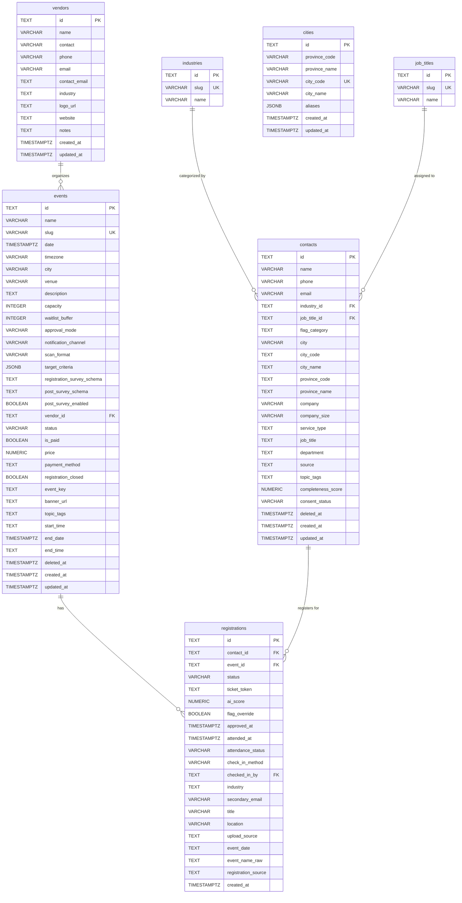
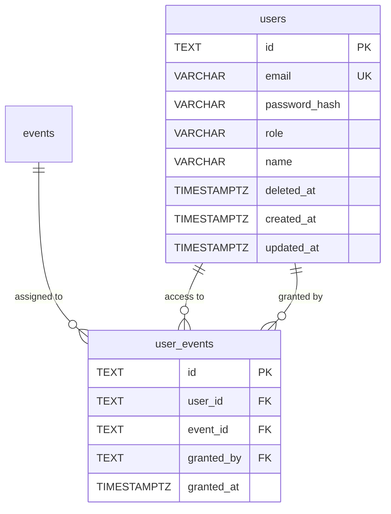
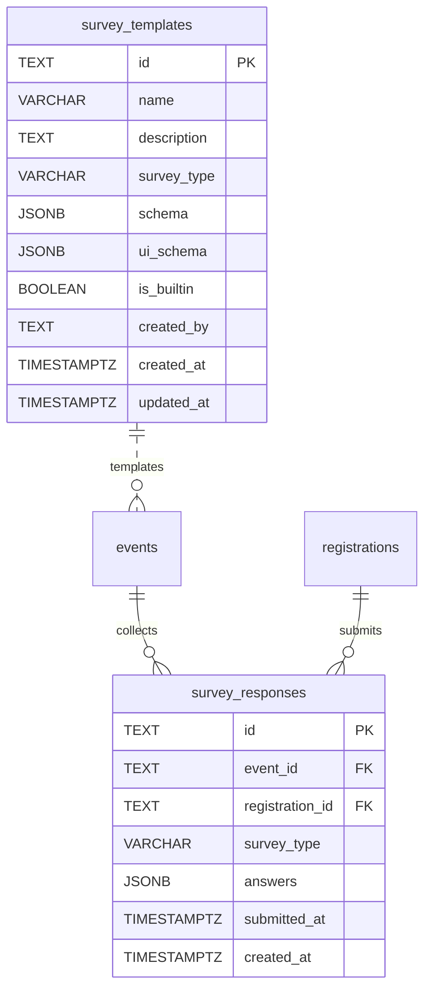
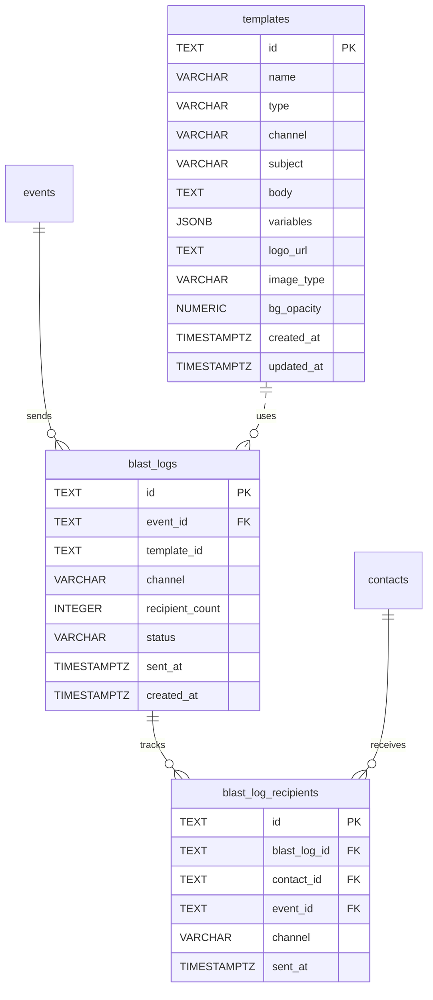
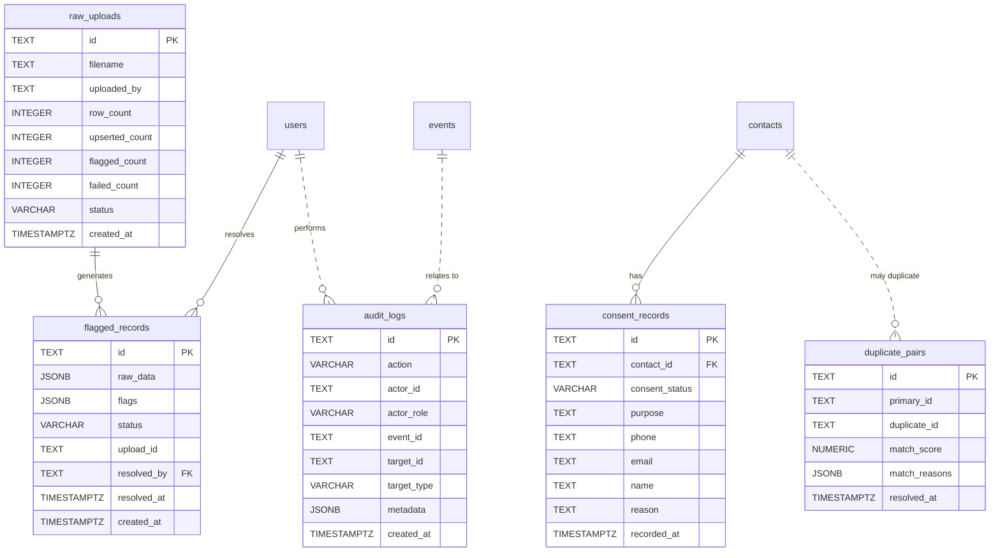
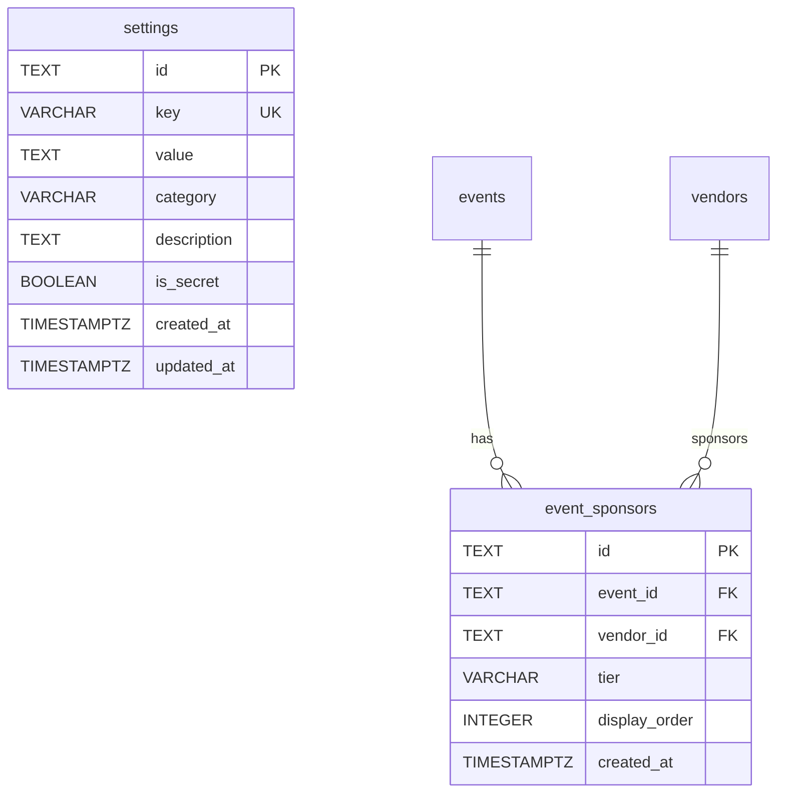

# EM · U — Database Schema Documentation

**Project:** EM · U Event Management Platform
**Updated:** 2026-04-13
**Database:** PostgreSQL 16
**Primary Keys:** TEXT (CUID2, application-generated)

---

## Entity Relationship Diagram

### Core Entities



### Users & Access



### Survey System



### Communication & Templates



### Audit & Compliance



### Settings & Sponsors



---

## Complete Table Reference

### Lookup Tables (3)

| Table | Purpose | Key Columns |
|-------|---------|-------------|
| **industries** | Standard industry list | `id`, `slug`, `name` |
| **job_titles** | Standard job title list | `id`, `slug`, `name` |
| **cities** | Indonesian wilayah data | `id`, `province_code`, `city_code`, `city_name` |

### Core Entity Tables (5)

| Table | Purpose | Key Columns |
|-------|---------|-------------|
| **contacts** | Contact database | `id`, `name`, `phone`, `email`, `flag_category`, `industry_id`, `job_title_id` |
| **events** | Event management | `id`, `name`, `slug`, `status`, `date`, `capacity`, `vendor_id` |
| **registrations** | Event registrations | `id`, `contact_id`, `event_id`, `status`, `ticket_token`, `attendance_status` |
| **vendors** | Vendor management | `id`, `name`, `contact`, `email`, `phone` |
| **users** | System users | `id`, `email`, `password_hash`, `role`, `name` |

### Access Control (1)

| Table | Purpose | Key Columns |
|-------|---------|-------------|
| **user_events** | Staff event assignments | `user_id`, `event_id`, `granted_by`, `granted_at` |

### Survey System (2)

| Table | Purpose | Key Columns |
|-------|---------|-------------|
| **survey_templates** | Reusable survey schemas | `id`, `name`, `survey_type`, `schema`, `is_builtin` |
| **survey_responses** | Submitted survey answers | `event_id`, `registration_id`, `survey_type`, `answers` |

### Communication (3)

| Table | Purpose | Key Columns |
|-------|---------|-------------|
| **templates** | Email/WhatsApp templates | `id`, `name`, `type`, `channel`, `subject`, `body` |
| **blast_logs** | Blast send history | `event_id`, `template_id`, `channel`, `recipient_count`, `status` |
| **blast_log_recipients** | Individual blast recipients | `blast_log_id`, `contact_id`, `event_id`, `channel` |

### Audit & Compliance (5)

| Table | Purpose | Key Columns |
|-------|---------|-------------|
| **flagged_records** | Data quality review queue | `raw_data`, `flags`, `status`, `upload_id`, `resolved_by` |
| **audit_logs** | System activity log | `action`, `actor_id`, `actor_role`, `target_id`, `metadata` |
| **raw_uploads** | ETL import tracking | `filename`, `row_count`, `upserted_count`, `flagged_count`, `status` |
| **duplicate_pairs** | Duplicate contact pairs | `primary_id`, `duplicate_id`, `match_score`, `match_reasons` |
| **consent_records** | PDP compliance tracking | `contact_id`, `consent_status`, `purpose`, `reason` |

### Settings & Sponsors (2)

| Table | Purpose | Key Columns |
|-------|---------|-------------|
| **settings** | Application configuration | `key`, `value`, `category`, `is_secret` |
| **event_sponsors** | Event sponsor assignments | `event_id`, `vendor_id`, `tier`, `display_order` |

---

## Enum Values

### `event_status`

| Value | Description |
|-------|-------------|
| `draft` | Event being prepared |
| `published` | Event published, registration open |
| `active` | Event is live, check-in enabled |
| `completed` | Event finished |
| `cancelled` | Event cancelled |
| `archived` | Event archived |

### `reg_status`

| Value | Description |
|-------|-------------|
| `pending` | Awaiting admin approval |
| `confirmed` | Registration confirmed |
| `approved` | Approved by admin |
| `rejected` | Rejected by admin |
| `waitlisted` | On waitlist |
| `attended` | Checked in at event |
| `cancelled` | Registration cancelled |
| `provisional` | Walk-in / OTS registration |

### `flag_category` (contacts)

| Value | Description |
|-------|-------------|
| `invalid-data` | Missing or invalid required fields |
| `duplicate` | Potential duplicate contact |
| `industry-unmatched` | Service type doesn't match standard |
| `jobtitle-unmatched` | Job title doesn't match standard |
| `spam` | Spam contact |
| `not-potential` | Not a potential attendee |
| `NULL` | Clean contact |

---

## Key Indexes

| Table | Index | Columns | Purpose |
|-------|-------|---------|---------|
| contacts | `idx_contacts_industry_id` | `industry_id` | Industry filtering |
| contacts | `idx_contacts_consent_status` | `consent_status` | Compliance queries |
| contacts | `idx_contacts_province_code` | `province_code` | Province filtering |
| events | `idx_events_status` | `status` (partial) | Active event queries |
| registrations | `idx_registrations_event_id_status` | `(event_id, status)` | Event registration status |
| registrations | `idx_registrations_attendance_status` | `attendance_status` | Attendance stats |
| blast_logs | `idx_blast_logs_event_id` | `event_id` | Event blast history |
| blast_log_recipients | `idx_blast_log_recipients_contact_event` | `(contact_id, event_id)` | Recipient tracking |
| survey_responses | `idx_survey_responses_event_type` | `(event_id, survey_type)` | Survey analytics |

---

## Data Flow

```
Upload .xlsx → raw_uploads → contacts (+ flagged_records if issues)
                                                      ↓
events ← blast_logs ← blast_log_recipients ← contacts
  ↓                        ↓
registrations ← survey_responses
  ↓
users (check-in)
```
