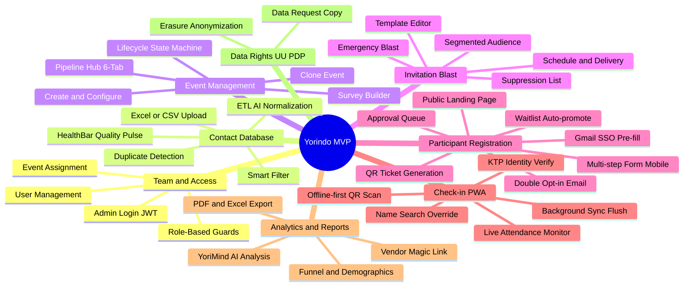
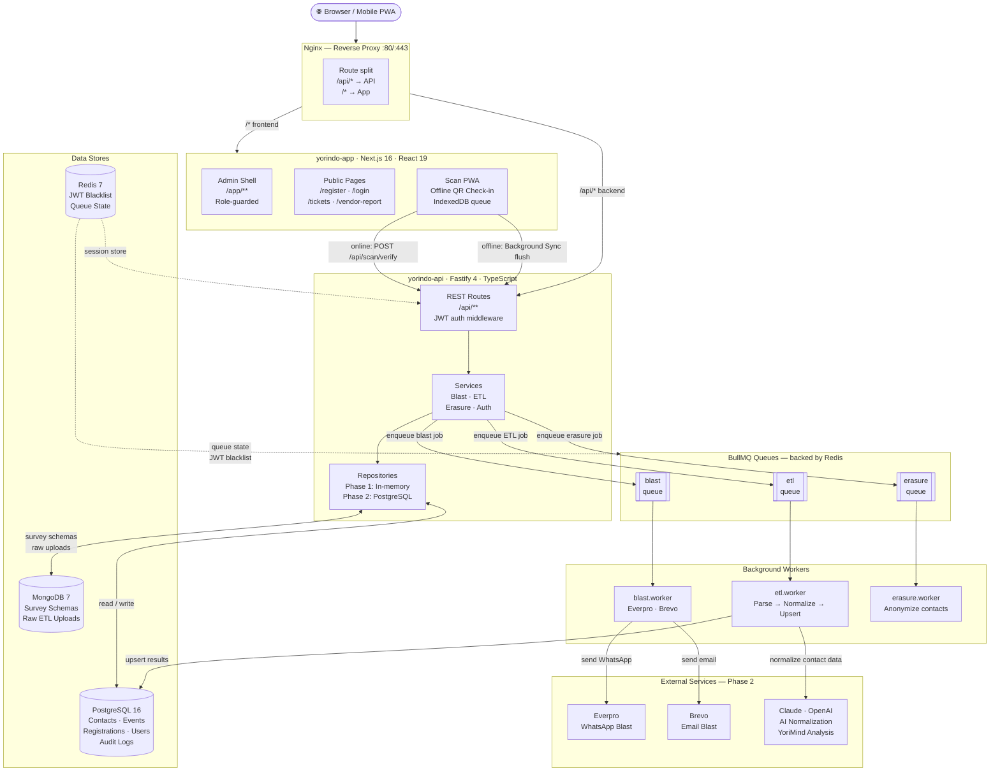
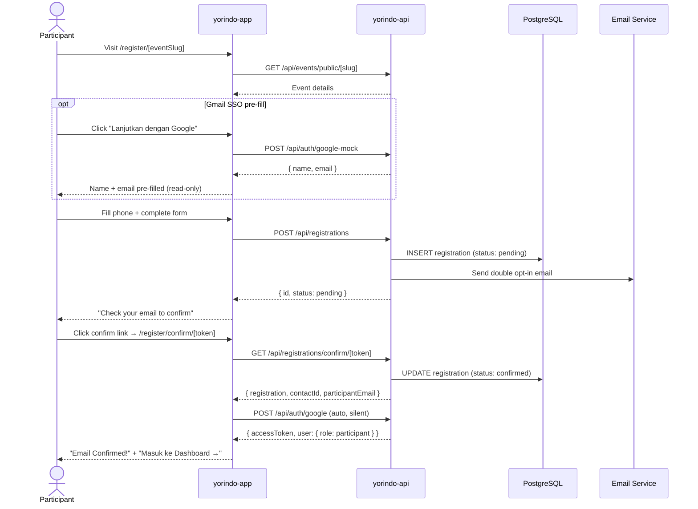
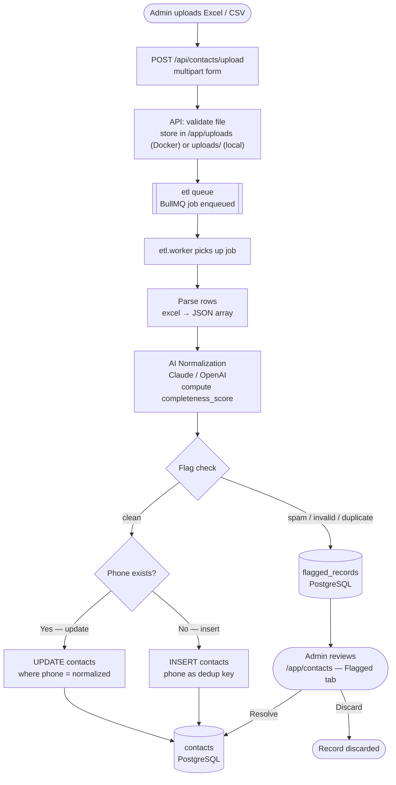
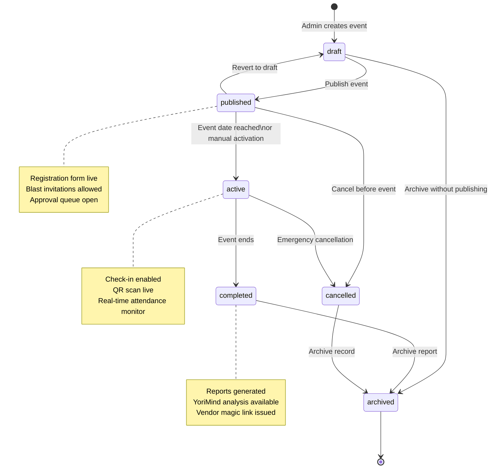
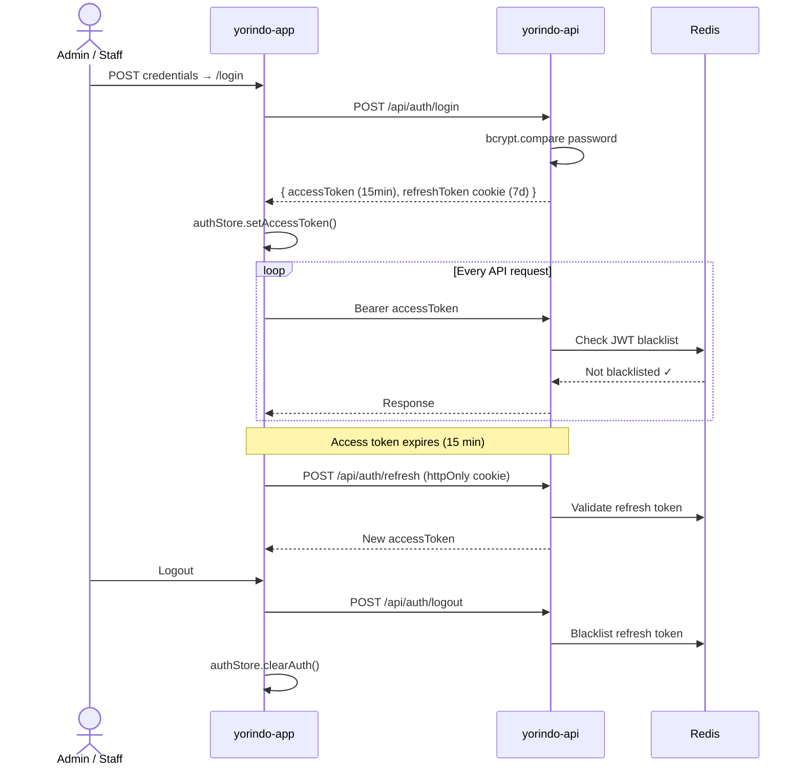
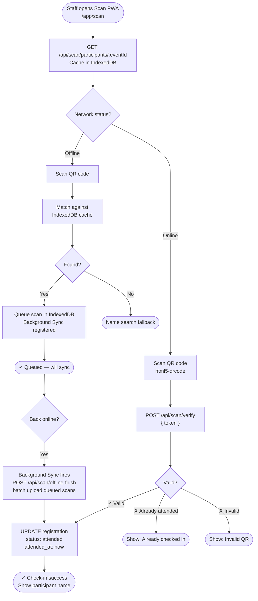

# Yorindo System Design

**Project:** Yorindo — Event Management Platform for KADA
**Version:** 1.0 (Quick Scan, 2026-03-25)
**Repository:** Monorepo (`/yorindo-app` + `/yorindo-api`)

---

## Table of Contents

1. [System Overview](#1-system-overview)
2. [Architecture](#2-architecture)
3. [Tech Stack](#3-tech-stack)
4. [Infrastructure Topology](#4-infrastructure-topology)
5. [Data Models](#5-data-models)
6. [API Design](#6-api-design)
7. [Frontend Architecture](#7-frontend-architecture)
8. [Backend Architecture](#8-backend-architecture)
9. [Authentication & Authorization](#9-authentication--authorization)
10. [Key Features & Flows](#10-key-features--flows)
11. [Development Approach](#11-development-approach)
12. [File Structure](#12-file-structure)

---

## Diagrams

### MVP Feature Map



---

### Architecture Overview with Queue Communication



---

### Registration Flow



---

### ETL Pipeline — Contact Upload



---

### Event Lifecycle State Machine



---

### Authentication & Session Flow



---

### Event-Day Check-in — Online + Offline



---

## 1. System Overview

Yorindo is a B2B event management platform that handles the full lifecycle of corporate events: contact database management, invitation blasting, participant registration with approval workflows, event-day QR check-in (offline-capable PWA), and post-event analytics.

**Core Actors:**

| Role | Description |
|------|-------------|
| `admin` | Full access — manages users, contacts, events, blasts, reports |
| `staff` | Event-scoped access — check-in, approvals for assigned events |
| `viewer` | Read-only — events and reports for assigned events |
| `participant` | Self-service — registration, ticket, dashboard |

---

## 2. Architecture

```
Browser / Mobile PWA
        │
        ▼
   ┌─────────┐
   │  Nginx  │  reverse proxy (ports 80/443)
   └────┬────┘
        │ route split: /app → yorindo-app, /api → yorindo-api
   ┌────┴────────────────────┐
   │                         │
   ▼                         ▼
┌──────────────┐    ┌────────────────────┐
│  yorindo-app │    │   yorindo-api      │
│  Next.js 16  │    │   Fastify 4        │
│  React 19    │    │   Node.js / TS     │
│  Port 3000   │    │   Port 3000        │
└──────────────┘    └────────┬───────────┘
                             │
              ┌──────────────┼──────────────┐
              ▼              ▼              ▼
         PostgreSQL 16   MongoDB 7      Redis 7
         (relational)    (documents)    (sessions/queues)
```

**Pattern:** Service-oriented monorepo. Frontend is a standalone Next.js app that communicates exclusively via the REST API. Backend follows a layered architecture: Routes → Services → Repositories → Databases.

**Development Phase:**
- **Phase 1 (current):** FE runs against MSW mock handlers; BE uses in-memory repositories. No real DB or external services in dev.
- **Phase 2:** BE connects to real PostgreSQL/MongoDB/Redis; real Everpro + Brevo integrations.

---

## 3. Tech Stack

### Frontend (`yorindo-app`)

| Category | Technology | Version |
|----------|-----------|---------|
| Framework | Next.js | ^16.2.0 |
| UI Library | React | ^19.2.4 |
| Language | TypeScript | ^5 |
| Styling | Tailwind CSS v4 | ^4.2.2 |
| Component Library | shadcn/ui (Radix UI) | ^1.4.3 |
| State Management | Zustand | ^5.0.12 |
| Server State / Cache | TanStack Query | ^5.91.0 |
| Table | TanStack Table | ^8.21.3 |
| Forms | React Hook Form + Zod | ^7 / ^4 |
| API Mocking (dev) | MSW | ^2.12.13 |
| Charts | Recharts | ^3.8.0 |
| QR Scanning | html5-qrcode | ^2.3.8 |
| QR Generation | react-qr-code | ^2.0.18 |
| PWA | Serwist (next) | ^9.5.7 |
| Notifications | Sonner | ^2.0.7 |
| Offline Storage | idb (IndexedDB) | ^8.0.3 |
| Testing | Vitest + Testing Library | ^4 / ^16 |
| Fake data | @faker-js/faker | ^10.3.0 |

### Backend (`yorindo-api`)

| Category | Technology | Version |
|----------|-----------|---------|
| Framework | Fastify | ^4.27.0 |
| Language | TypeScript | ^5.4.5 |
| Runtime | Node.js ESM | — |
| Validation | Zod | ^3.23.8 |
| Auth | JWT (jsonwebtoken) + bcrypt | ^9 / ^5 |
| Database (relational) | PostgreSQL 16 (pg driver) | ^8.11.5 |
| Database (documents) | MongoDB 7 (driver) | ^6.5.0 |
| Cache / Sessions | Redis 7 (ioredis) | ^5.3.2 |
| Queue / Jobs | BullMQ | ^5.7.15 |
| AI Normalization | Anthropic SDK (Claude) + OpenAI | ^0.20.9 / ^4.47.1 |
| Scheduled Jobs | node-cron | ^3.0.3 |
| QR Generation | qrcode | ^1.5.3 |
| Excel Export | xlsx | ^0.18.5 |
| Logging | Pino + pino-http | ^9 / ^10 |
| Testing | Vitest | ^1.6.0 |

### Infrastructure

| Service | Image | Purpose |
|---------|-------|---------|
| Nginx | nginx:alpine | Reverse proxy, TLS termination |
| PostgreSQL | postgres:16-alpine | Primary relational store |
| MongoDB | mongo:7 | Survey schemas, raw ETL uploads |
| Redis | redis:7-alpine | Session blacklist, BullMQ queues |

---

## 4. Infrastructure Topology

### Production (`docker-compose.yml`)

```
Internet → Nginx (80/443)
              ├── /api/* → yorindo-api:3000
              └── /*     → yorindo-app:3000

yorindo-api → postgres:5432 (internal)
           → mongodb:27017 (internal)
           → redis:6379 (internal)

Volumes:
  postgres_data  – PostgreSQL data persistence
  mongo_data     – MongoDB data persistence
  redis_data     – Redis AOF persistence
  snapshots_data – /data/snapshots (API snapshots)
  api_uploads    – /app/uploads (Docker ETL file staging) / uploads (local)
```

### Development (`docker-compose.dev.yml`)

Separate dev compose file — presumed to expose ports directly without Nginx for local development.

---

## 5. Data Models

### PostgreSQL (Relational)

#### `contacts`
Primary entity for the contact database.

| Column | Type | Notes |
|--------|------|-------|
| id | TEXT PK | app-generated CUID2 / opaque ID |
| name | VARCHAR(200) | Required |
| phone | VARCHAR(20) UNIQUE | Normalized: +62XXXXXXXXXX — **primary identity key** |
| email | VARCHAR(200) UNIQUE | Optional |
| industry_id | TEXT FK → industries | |
| job_title_id | TEXT FK → job_titles | |
| city | VARCHAR(100) | |
| company | VARCHAR(200) | |
| company_size | VARCHAR(20) | '<50', '50-200', '200-1000', '>1000' |
| source | VARCHAR(50) | 'excel_upload', 'form', 'manual' |
| completeness_score | NUMERIC(4,3) | 0.000–1.000, AI-computed in ETL |
| consent_status | VARCHAR(30) | 'active', 'suppressed', 'legacy_unverified' |
| flag_category | VARCHAR(50) | 'spam', 'not-potential', null = clean |
| deleted_at | TIMESTAMPTZ | Soft delete |

#### `events`
Event lifecycle entity.

| Column | Type | Notes |
|--------|------|-------|
| id | TEXT PK | |
| name | VARCHAR(300) | |
| slug | VARCHAR(150) UNIQUE | URL-safe identifier |
| date | TIMESTAMPTZ | Event date |
| timezone | VARCHAR(50) | Default: Asia/Jakarta |
| capacity | INTEGER | |
| waitlist_buffer | INTEGER | |
| approval_mode | VARCHAR(20) | 'auto', 'manual', 'hybrid' |
| notification_channel | VARCHAR(20) | 'email', 'whatsapp' |
| target_criteria | JSONB | Audience targeting rules |
| survey_schema_id | TEXT | MongoDB ObjectId reference |
| vendor_id | TEXT FK → vendors | |
| status | event_status ENUM | draft → published → active → completed/cancelled/archived |
| deleted_at | TIMESTAMPTZ | Soft delete |

**Status Enum:** `draft`, `published`, `active`, `completed`, `cancelled`, `archived`

#### `registrations`
Join between contacts and events.

| Column | Type | Notes |
|--------|------|-------|
| id | TEXT PK | |
| contact_id | TEXT FK → contacts | CASCADE delete |
| event_id | TEXT FK → events | CASCADE delete |
| status | reg_status ENUM | |
| ticket_token | TEXT | QR code token (generated on approval) |
| ai_score | NUMERIC(4,3) | AI approval score |
| flag_override | BOOLEAN | Admin can clear a flag |
| attended_at | TIMESTAMPTZ | Set on check-in |
| UNIQUE(contact_id, event_id) | | One registration per contact per event |

**Status Enum:** `pending`, `confirmed`, `approved`, `rejected`, `waitlisted`, `attended`, `cancelled`

#### `users`
Staff/admin accounts.

| Column | Type | Notes |
|--------|------|-------|
| id | TEXT PK | |
| email | VARCHAR(200) UNIQUE | |
| password_hash | VARCHAR(255) | bcrypt |
| role | VARCHAR(20) | 'super_admin', 'event_admin', 'staff', 'vendor_client', 'participant' |
| name | VARCHAR(200) | |

#### `user_events`
Scopes staff/viewer access to specific events.

| Column | Notes |
|--------|-------|
| user_id FK, event_id FK | UNIQUE per pair |
| granted_by FK | Who granted access |

#### Other Tables

| Table | Purpose |
|-------|---------|
| `industries` | Lookup: industry slugs/names |
| `job_titles` | Lookup: job title slugs/names |
| `vendors` | Event vendor records |
| `flagged_records` | ETL-flagged rows pending review |
| `audit_logs` | Append-only audit trail (`{resource}.{verb}` actions) |
| `consent_records` | UU PDP consent tracking per contact |

### MongoDB (Documents)

| Collection | Purpose |
|------------|---------|
| Survey schemas | Dynamic survey JSONB templates per event |
| Raw ETL uploads | Raw Excel/CSV upload data before normalization |

---

## 6. API Design

**Base URL:** `/api`
**Format:** REST, JSON body + JSON responses
**Error format:** `{ error: { code: string, message: string, details: [] } }` — universal
**Auth:** Bearer JWT in `Authorization` header
**Pagination:** `?page=1&pageSize=20` → `{ data: [], pagination: { page, pageSize, total, totalPages } }`
**Rate limiting:** 100 req/min global; POST `/api/registrations` limited to 10 req/hour per IP

### API Endpoints (from OpenAPI spec `yorindo-api/openapi.yaml`)

| Domain | Key Endpoints |
|--------|--------------|
| **Auth** | `POST /auth/login`, `POST /auth/refresh`, `POST /auth/logout`, `POST /auth/google`, `POST /auth/google-mock` |
| **Users** | `GET /users`, `POST /users`, `PATCH /users/:id/role`, `DELETE /users/:id`, `GET /users/:id/events`, `PUT /users/:id/events` |
| **Events** | `GET /events`, `POST /events`, `GET /events/:id`, `PATCH /events/:id`, `DELETE /events/:id`, `POST /events/:id/clone`, `PATCH /events/:id/status`, `GET /events/public/:slug` |
| **Registrations** | `GET /registrations`, `POST /registrations`, `GET /registrations/:id`, `POST /registrations/:id/status`, `PUT /registrations/:id/status`, `PUT /registrations/bulk-approve`, `POST /registrations/:id/cancel`, `POST /registrations/:id/resend-ticket`, `POST /registrations/:id/clear-flag`, `GET /registrations/confirm/:token` |
| **Contacts** | `GET /contacts`, `POST /contacts/upload`, `GET /contacts/lookup`, `GET /contacts/health`, `GET /contacts/facets`, `GET /contacts/duplicates`, `POST /contacts/merge`, `PATCH /contacts/:id/flag`, `GET /contacts/:id/history` |
| **Blast** | `POST /blast`, `GET /blast/:jobId`, `POST /blast/emergency`, `POST /blast/prefilled-audience` |
| **Templates** | `GET /templates`, `POST /templates`, `PATCH /templates/:id`, `DELETE /templates/:id` |
| **Tickets** | `GET /tickets/:token` |
| **Scan** | `POST /scan/verify`, `GET /scan/participants/:eventId`, `POST /scan/offline-flush` |
| **Reports** | `GET /reports/:eventId`, `POST /reports/:eventId/generate`, `GET /reports/vendor/:magicToken` |
| **YoriMind** | `POST /yorimind/analyze` |
| **Data Rights** | `POST /data-rights/request`, `POST /data-rights/erasure` |

---

## 7. Frontend Architecture

### App Router Structure (`yorindo-app/src/app/`)

```
src/app/
├── layout.tsx              — Root layout (providers, fonts, theme)
├── page.tsx                — Public landing page
├── login/                  — Admin/staff login + participant Google SSO
├── register/
│   └── [eventSlug]/
│       ├── page.tsx        — Public event landing
│       └── form/           — Registration form (mobile-first, multi-step)
├── register/confirm/[token]/ — Double opt-in confirmation + account creation
├── tickets/[token]/         — Ticket display page
├── vendor-report/[token]/   — Vendor magic-link report page
├── data-rights/             — UU PDP data request/erasure forms
└── app/                     — Protected admin/staff shell (requires auth)
    ├── layout.tsx           — Auth guard + AdminShell wrapper
    ├── page.tsx             — Dashboard (role-branched)
    ├── events/              — Event list + pipeline hub per event
    ├── contacts/            — Contact database
    ├── blast/               — Invitation blast
    ├── templates/           — Message templates
    ├── users/               — Account management
    ├── scan/                — QR check-in PWA
    └── yorimind/            — AI analysis panel
```

### State Management

| Store | Purpose |
|-------|---------|
| `authStore` (Zustand) | Access token + user `{ id, role, name?, email? }` — in-memory, not persisted |
| `eventStore` (Zustand) | Active event context |
| `filterStore` (Zustand) | Contact filter state |
| TanStack Query | All server state: fetching, caching, invalidation |

### Auth Store Shape

```typescript
interface AuthStore {
  accessToken: string | null
  user: {
    id: string
    role: 'admin' | 'staff' | 'viewer' | 'participant'
    name?: string   // populated for participants via Google SSO
    email?: string  // populated for participants via Google SSO
  } | null
  setAccessToken: (token: string, user: AuthStore['user']) => void
  clearAuth: () => void
}
```

### Route Guards (`app/layout.tsx`)

- No `accessToken` → redirect `/login`
- `viewer` role → restricted to `/app` and `/app/events/**`
- `participant` role → restricted to `/app` only

### Mock Service Worker (MSW v2)

All API calls in Phase 1 are intercepted by MSW handlers in `src/mocks/handlers/`. Each domain has its own handler file with an in-memory store simulating real API behavior. MSW is initialized in `src/mocks/browser.ts` and enabled via `src/app/providers/MSWProvider.tsx`.

### PWA (Serwist)

- Service worker: `src/app/sw.ts` → compiled to `public/sw.js`
- Offline-capable QR check-in via `idb` (IndexedDB) queue + Background Sync
- PWA install banner: `components/features/scan/PWAInstallBanner.tsx`
- Disabled in development (`NODE_ENV === 'development'`)

### Component Architecture

```
src/components/
├── auth/           — MockGoogleAuthDialog (Phase 1 SSO simulation)
├── dev/            — DevToolbar (role switcher, mock controls — dev only)
├── features/       — Domain feature components
│   ├── contacts/
│   ├── dashboard/  — Role-differentiated dashboards
│   ├── events/
│   ├── scan/
│   └── users/
├── forms/          — Shared form components
├── hub/            — Event Pipeline Hub tabs
├── icons/          — Shared SVG icon components (GoogleIcon, etc.)
├── layout/         — AdminShell, sidebar, mobile nav
├── providers/      — QueryProvider, MSWProvider, ThemeProvider
└── ui/             — shadcn/ui base components
```

---

## 8. Backend Architecture

### Layer Structure

```
HTTP Request
     │
     ▼
Routes (Fastify plugins)
     │
     ▼
Services (business logic)
     │
     ├──► Repositories (data access abstraction)
     │         ├── memory/  (Phase 1: in-memory)
     │         └── postgres/ (Phase 2: real DB)
     │
     └──► External Adapters
               ├── adapters/mock/   (Phase 1 stubs)
               └── adapters/real/   (Phase 2: Everpro, Brevo, Claude API)
```

### Dependency Injection

`src/container.ts` wires all dependencies — repositories, services, adapters. Switching Phase 1 → Phase 2 requires only changing the container bindings.

### Services

| Service | Responsibility |
|---------|---------------|
| `blast.service.ts` | Invitation blast orchestration, BullMQ job dispatch |
| `etl.service.ts` | Excel/CSV ETL pipeline: parse → normalize (AI) → upsert |
| `erasure.service.ts` | UU PDP data erasure/anonymization |

### Workers (BullMQ)

| Worker | Queue | Purpose |
|--------|-------|---------|
| `blast.worker.ts` | blast | Process invitation send jobs (Everpro/Brevo) |
| `etl.worker.ts` | etl | Process uploaded contact files |
| `erasure.worker.ts` | erasure | Async data anonymization |

### Repositories (Phase 1 — in-memory)

| Repository | Entity |
|------------|--------|
| `ContactRepository.ts` | contacts |
| `EventRepository.ts` | events |
| `RegistrationRepository.ts` | registrations |
| `UserRepository.ts` | users |
| `FlaggedRecordsRepository.ts` | flagged ETL records |
| `SurveyRepository.ts` | survey schemas |
| `SuppressionRepository.ts` | consent/suppression |

### Migrations (PostgreSQL)

| File | Contents |
|------|----------|
| `001_core_schema.sql` | industries, job_titles, vendors, contacts, events, registrations |
| `002_users_access.sql` | users, user_events |
| `003_audit_flagged.sql` | flagged_records, audit_logs, consent_records |
| `004_indexes.sql` | Performance indexes |

---

## 9. Authentication & Authorization

### Flow (Phase 2)

```
POST /api/auth/login
  → validate credentials → bcrypt compare
  → issue short-lived JWT access token (15min)
  → set httpOnly refresh token cookie (7d)
  → return { accessToken, user }

POST /api/auth/refresh
  → validate refresh token cookie
  → check Redis blacklist
  → issue new access token
  → return { accessToken, user }

POST /api/auth/logout
  → add refresh token to Redis blacklist
  → clear cookie
```

### Participant SSO (Phase 1 Mock → Phase 2 Google OAuth)

```
Phase 1 (Mock):
  POST /api/auth/google-mock  → simulates Google OAuth pre-fill (name, email only)
  POST /api/auth/google       → creates participant session after double opt-in confirmation

Phase 2:
  Real Google OAuth PKCE flow → same /api/auth/google endpoint
```

### JWT Payload

```json
{ "sub": "user-cuid2-or-opaque-id", "role": "admin|staff|viewer|participant", "iat": ..., "exp": ... }
```

### Role-Based Access

| Role | Scope |
|------|-------|
| `admin` | Full platform access |
| `staff` | Event-scoped: assigned events only (check-in, approvals) |
| `viewer` | Read-only: `/app` and `/app/events/**` only |
| `participant` | Self-service: `/app` dashboard only (tickets, cancellation) |

---

## 10. Key Features & Flows

### Contact Upload & ETL Pipeline

```
Admin uploads Excel/CSV
  → POST /api/contacts/upload (multipart)
  → BullMQ ETL worker processes:
      1. Parse rows
      2. Normalize via AI (Claude/OpenAI) — computes completeness_score
      3. Detect duplicates → flagged_records
      4. Upsert into contacts (phone as dedup key)
  → Admin reviews flagged records → resolve/discard
```

### Event Registration Flow (Participant)

```
Participant visits /register/[eventSlug]
  → Optionally: Google SSO pre-fills name + email (MockGoogleAuthDialog)
  → Fills phone (always manual — primary identity)
  → Multi-step form: Contact Info → Survey → Confirm
  → POST /api/registrations → status: pending

POST /api/registrations/confirm/:token (double opt-in)
  → Registration confirmed
  → Auto-creates participant account (POST /api/auth/google)
  → Participant session set in authStore
  → "Masuk ke Dashboard" button shown
```

### Invitation Blast Flow

```
Admin selects audience (filter or AI-curated)
  → Configure template, channel (email/whatsapp), schedule
  → POST /api/blast → BullMQ job queued
  → Worker dispatches via Everpro (WhatsApp) or Brevo (email)
```

### QR Check-in (Offline-first PWA)

```
Staff installs PWA on device
  → GET /api/scan/participants/:eventId → cached in IndexedDB
  → Scan QR code → POST /api/scan/verify (online)
  → If offline: queue in IndexedDB → Background Sync auto-flushes on reconnect
  → Manual name search fallback
```

### YoriMind AI Analysis

```
Admin requests analysis for completed event
  → POST /api/yorimind/analyze
  → Claude Sonnet API processes attendance + demographics data
  → Returns: root_causes, recommendations (priority: high/medium/low), summary
```

---

## 11. Development Approach

### Phase 1 — FE-first, Concurrent FE+BE (Mock-first)

- **Frontend:** All API calls intercepted by MSW v2 handlers in `src/mocks/handlers/`
- **Backend:** In-memory repositories (`repositories/memory/`) — no real DB
- **No real external services:** Everpro, Brevo, Claude API all mocked
- **Gate:** Story 1.4 (OpenAPI spec) must be complete before any Epic 2+ story begins
- **Story 1.8** is the Phase 1 BE gate (service adapter scaffold)

### Phase 2 — Real Backend

- Swap in-memory repos for PostgreSQL/MongoDB implementations (`repositories/postgres/`)
- Swap mock adapters for real service adapters (`services/adapters/real/`)
- Redis for JWT blacklist + BullMQ
- Real Google OAuth replacing `/api/auth/google-mock`

### Developer Tools

- **DevToolbar** (`src/components/dev/DevToolbar.tsx`) — visible in dev only; instant role switching (admin/staff/viewer/participant), MSW toggle
- MSW DevTools available in browser
- `vitest.config.ts` + `vitest.setup.ts` — unit/integration tests
- `fake-indexeddb` for offline queue testing without real IndexedDB

---

## 12. File Structure

```
yorindo/                           ← Monorepo root
├── docs/                          ← Project knowledge (this folder)
│   ├── system-design.md           ← This document
│   ├── secrets-setup.md           ← Environment variable guide
│   └── yorindo_system_design_v1_18 03 26.pdf
├── _bmad-output/
│   ├── planning-artifacts/        ← PRD, architecture, epics, UX specs
│   └── implementation-artifacts/  ← Sprint status + story files
├── yorindo-app/                   ← Next.js 16 frontend
│   └── src/
│       ├── app/                   ← Next.js App Router pages
│       ├── components/            ← UI components
│       │   ├── ui/                ← shadcn/ui base
│       │   ├── features/          ← Domain components
│       │   ├── layout/            ← AdminShell, nav
│       │   ├── auth/              ← Auth dialogs
│       │   ├── icons/             ← Shared SVG icons
│       │   └── dev/               ← DevToolbar
│       ├── hooks/                 ← TanStack Query hooks per domain
│       ├── store/                 ← Zustand stores
│       ├── types/                 ← TypeScript API types
│       ├── mocks/                 ← MSW handlers + browser setup
│       ├── lib/                   ← Utilities (cn, djb2, etc.)
│       └── utils/                 ← Helper functions
├── yorindo-api/                   ← Fastify 4 backend
│   ├── src/
│   │   ├── routes/                ← Fastify route plugins
│   │   ├── services/              ← Business logic
│   │   │   └── adapters/          ← External service adapters (mock/real)
│   │   ├── repositories/          ← Data access layer
│   │   │   ├── memory/            ← Phase 1 in-memory repos
│   │   │   └── postgres/          ← Phase 2 real DB repos
│   │   ├── workers/               ← BullMQ background workers
│   │   ├── middleware/            ← Auth, validation middleware
│   │   ├── types/                 ← Backend TypeScript types
│   │   ├── interfaces/            ← Repository/service interfaces
│   │   ├── config/                ← App configuration
│   │   ├── container.ts           ← DI container
│   │   ├── server.ts              ← Fastify server factory
│   │   └── main.ts                ← Entrypoint
│   ├── migrations/                ← PostgreSQL migration SQL files
│   └── openapi.yaml               ← OpenAPI 3.0 spec (API contract)
├── nginx/                         ← Nginx reverse proxy config
├── docker-compose.yml             ← Production services
├── docker-compose.dev.yml         ← Development services
└── .github/                       ← CI/CD workflows
```

---

*Generated by bmad-document-project (quick scan) — 2026-03-25*
